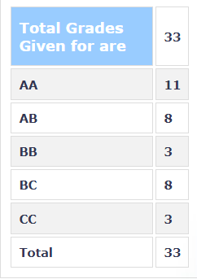

**Review by**

Nirmal Shah, 2024(Dual Degree)

**Course Offered In**

Spring 2021

**Instructors**

Prof Subhananda Chakrabarti

**Prerequisites**

No hard pre-requisite. Can learn things on the go. Few concepts related to EE-207, like k-space and working of a PN-junction diode.

**Difficulty**

2 (1 being easy, 5 being difficult)

**Course Content**

This is more of a theory course and not a heavy mathematical one.

Have to remember the theory since most of the questions in the exams were binary, &quot;whether you know it, or you don&#39;t.&quot; The study pattern is very much similar to the inorganic chemistry of JEE, where we had to remember the facts and develop the reasoning behind them.

The prof was very much enthusiastic and took feedback from the students quite frequently. We also had guest speakers from universities telling us about the latest research happening in the growth and fabrication of semiconductors.

The best part of the course was that we had a lab visit to the nanoelectronics lab, where we had to put on special clothes and see the machines used for chip fabrication. The concepts explained during those demonstrations were very interesting and effective.

The prof covered a variety of topics, and there was more breadth as compared to depth. Here are some of the broad areas which were covered in the course (Directly taken from the course website)

- Basic Growth Concepts: growth modes; crystallization phenomena; defects
- Fundamentals and analysis of epitaxy: liquid phase epitaxy; molecular beam epitaxy
- Chemical vapor deposition; LPCVD examples (SiO2, Si3N4, Poly-Si, Silicon epitaxy); MOCVD, examples: dielectrics, epitaxy of III-V; PECVD; ALD.
- Material Systems and Structures: GaAs and InP-based materials: AlGaAs, GaInAs, and InGaAsP; substrates, material purity, doping, ordering; heterostructures, interfaces; strained layer growth, critical thickness; Group III nitrides: AlGaInN and InGaAsN; Device structures: Detectors, Lasers, HEMTs.
- Characterization of Nanoelectronic Materials: Photoluminescence; X-Ray diffraction; Transmission Electron Microscopy; Deep Level Transient spectroscopy; Atomic Force Microscopy; Secondary Electron Microscopy.

**Feedback on Lectures**

Instead of having live lectures, we were provided with the last year&#39;s(2021) recording. There were also live online sessions for doubt solving and re-explaining some of the difficult concepts. Attendance was not compulsory, but the prof encouraged to attend the live sessions since sometimes there might be a topic discussed more in-depth in the live session but not in the lecture slides. Tutorials were conducted to get more information about III-V semiconductors.

**Feedback on Evaluations**

We had short quizzes at regular intervals so that there wasn&#39;t any backlog for the endsems. We had typical midsems and endsems theory papers. The evaluation is very chill.

**Study Material and References**

Prof gives slides for each topic, and it is self-sufficient to get at least AB with regular study. For some concepts had to google.

**Follow-up Courses**

Any growth/fabrication/nanoelectronics course can be taken up. This course was more of a stand-alone type to get us introduced to III-V semiconductors instead of conventional Silicon semiconductors.

**Final Takeaways**

This course was very much useful for someone doing work in fabrication and devices. One gets to know more about the challenges involved during fabrication and what are the trade-offs faced. If you are looking to take a chill elective from a grading perspective, then I would recommend you to take up any course under this professor.

**Grading Statistics:**

