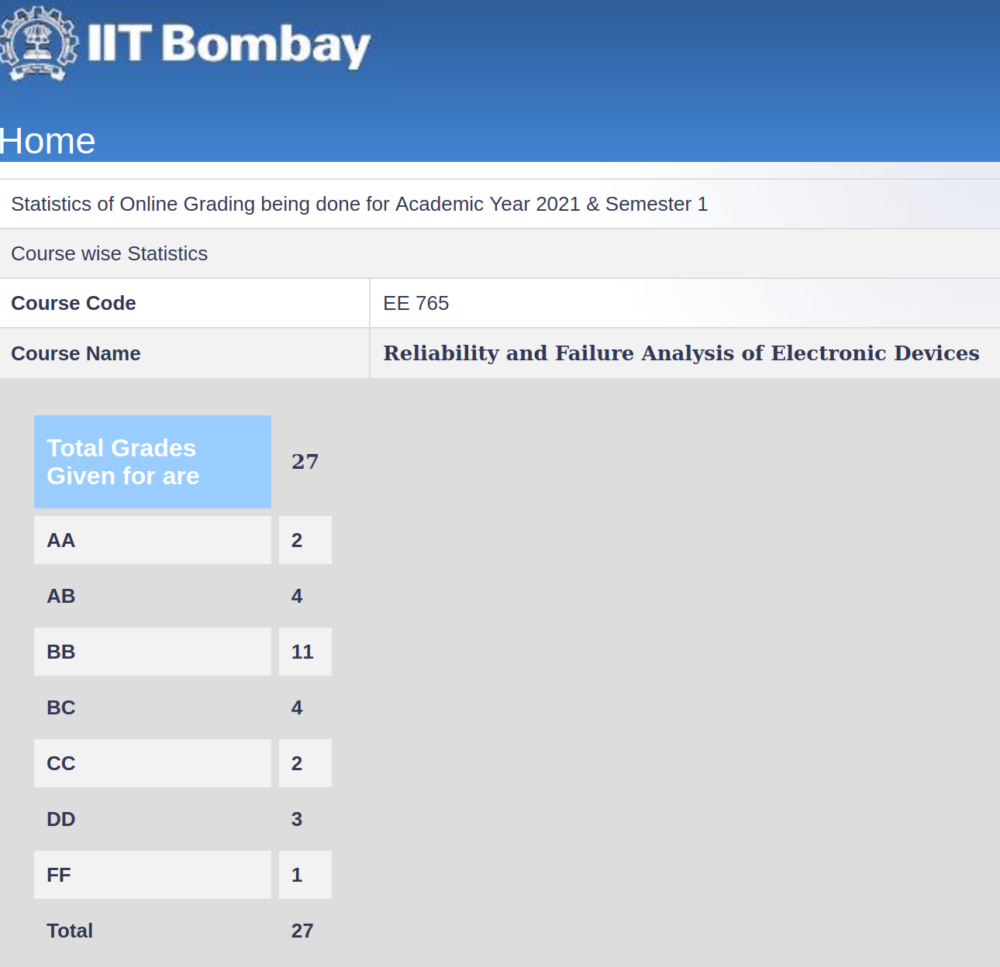

Varad Rajesaheb Mane, 2023(DD)

**Course Offered In**

Autumn, 2021-2022

**Instructors**

Narendra Shiradkar

**Prerequisites**

None, the professor covers all the required probability and coding basics required to complete the assignments and the project as well(although there wasn’t any project in the semester I did the course).

**Difficulty**

1.5 on a scale of 1-5.

**Course Content**

The crux of the course is to introduce mathematical approaches to quantify reliability and use multiple probabilistic models to model the various failures that are observed in electronic devices, and cascade these to develop a system-level reliability equation/model. Here’s how the content was covered in the semester I’ve completed the course in:

- Definitions of reliability/quality
- Tests and some relevant accuracy metrics
- Probability basics for reliability (PDF, CDF, Central Limit Theorem)
- Failure rates and relevant metrics, constant failure rate model
- Reliability of series & parallel connected systems
- Binomial distribution, bathtub curve’s application in reliability
- Parts Count and Parts Stress Models
- Military Handbook MIL-HDBK-217F
- Use of Best Fit curves and Maximum Likelihood Estimators for reliability, the Weibull Distribution
 
**Feedback on Lectures**

Professor Narendra explains all the concepts having made the assumption that course-takers don’t have any background of any topic, hence it’s pretty easy to digest the course contents. We used to have a class activity every lecture, in which either some subjective question relevant to the material was raised which had to be done in groups, which were rotated every week, or an objective question, which had to be solved in a group, sometimes using python.
Feedback on Evaluations
Since the course was online, each uploaded lecture had subsequent simple quizzes, which were simple as the name suggests, and we had 3 assignments as well, which were a mix of paper-solving and python. There were also moodle activities based on the topic, which focussed on exploring devices around us and questioning their reliability. There were no quizzes other than the simple quizzes, and we did have a mid semester as well as an end semester exam. We didn’t have a project this semester, which wasn’t the case last time the course ran. 

**Study Material and References**

The lecture videos were self sufficient, and we didn’t refer to anything else apart from the Military Handbook.

**Follow-up Courses**

None

**Final Takeaways**

It’s a nice course which puts into perspective a quantified approach of reliability. We couldn’t really cover the entire content probably due to the online nature of the class, but the material was definitely thought provoking. 

**Grading Statistics:**

