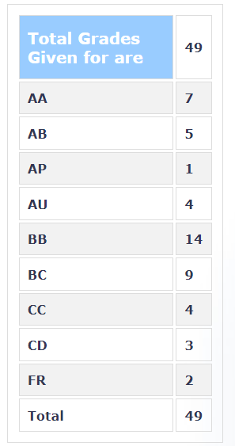

**Review by**  
Ishan Phansalkar, 2024(IDDDP CMInDS)

**Course Offered In**  
Autumn 2022

**Instructors**  
Prof. Dwaipayan Mukherjee

**Prerequisites**  
MA106: Linear Algebra (Not required but helpful)

**Difficulty**  
Moderate

**Course Content**  
- Design of logic gates
    - Different design styles for logic gates
    - Dynamic logic
    - Static and dynamic performance metrics
    - Parasitic elements, design rules and layout
- Storage circuits
- Design of multi-stage logic
- Semi-custom design
- Arithmetic circuits
- Semiconductor memories
- I-O circuits 

**Feedback on Lectures**  
The course content is carefully planned and organized. The prof is receptive to questions and goes over the concepts again if asked. In all a very interactive teaching style focusing on understanding over problem-solving.

**Feedback on Evaluations**  
The grading policy followed for the Autumn '22 offering of the course was:
- Assignments : 10% (5 x 2%)
- Quizzes     : 15% (3 x 5%)
- Midsem      : 25%
- Endsem      : 50%

The assignments are lengthy and take a long time to solve but are also helpful from the exam pov. Contain about 20 fairlt involved questions each.
 
All the exams are slightly on the more challenging side but reasonably straightforward if you’re thorough with the basics and comfortable with proof writing.

**Study Material and References**  
No slides; you’ll be required to take notes.

**Final Takeaways**  
A really good course in linear algebra builds over stuff covered in MA106 and delves into some of the more abstract (read: interesting) parts of linear algebra.

**Grading Statistics:**  

