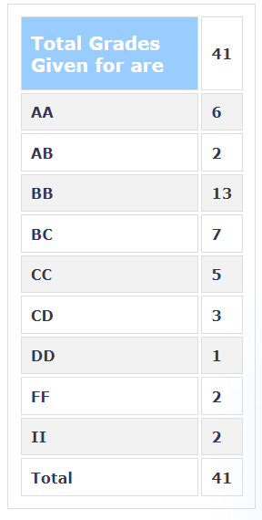

**Review By**

Ayush M Gopal

**Course Offered In**

Spring 2022

**Instructors**

Prof. Madhu Belur

**Prerequisites**

No hard prerequisites, but a fair understanding of linear algebra would come to aid as a few topics like vector spaces, matrix algebra, rank, eigenvalues etc. are assumed to be completed and hence skipped through.

**Difficulty**

(4/5) The course is a bit on the difficult side, considering that a lot of content is covered and it's very difficult to manage the future lectures if you do not understand the concept taught in the previous lectures.

**Course Content**

Basic iterative methods for solutions of linear systems and their rates of convergence. Generalized conjugate gradient, Krylov space and Lanczos methods. Iterative methods for symmetric, non-symmetric and generalized eigenvalue problems. Singular value decompositions. Fast computations for structured matrices. Polynomial matrix computations. Perturbation bounds for eigenvalues.

**Feedback on Lectures**

The lectures were not well organized, the professor used to annotate the slides itselfbut it was really very difficult to figure out what is going on if somebody later try to view the slides for reference eg- [here](https://drive.google.com/file/d/1cc1xg7Hukc_JR73vGxlgkMYC5ptKQKqn/view?usp=sharing). Also, the professor was not open to suggestions. 

**Feedback on Evaluations**

The exams were difficult, the course had a lot of formula but still, cheatsheet was not allowed. In one exam professor gave us an additional sheet of some 80 formulas to learn :( .The grading was on the tougher side.

**Study Material and References**

Golub & van Loan

**Follow-up Courses**

I am not aware of any particular course in matrix theory, but this course would really help if one is pursuing courses in Control as I can evidently see a few topics overlapping in EE302 itself. Further, it would also cover a few topics overlapping with machine learning.

**Final Takeaways**

The course content is on the difficult side, but learnings from it will come in handy at many places. Attending lectures regularly is the best way to ace the course.

**Grading Statistics:**

