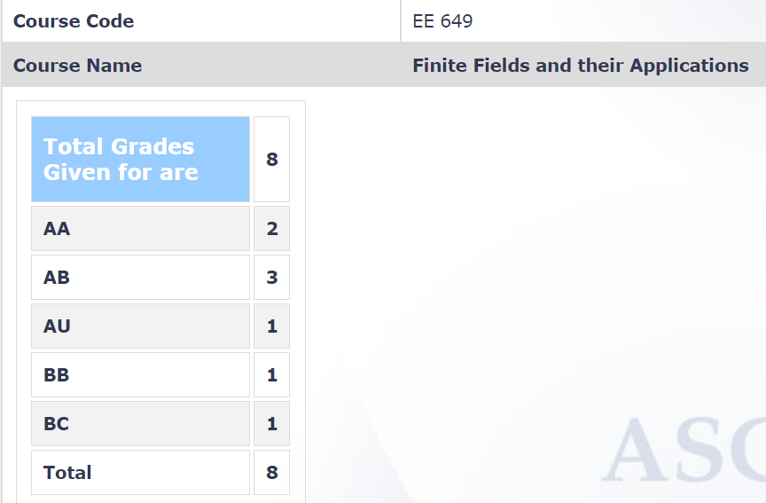

**Your Name and Batch (Eg: Ishaan Phansalkar, 2024(DD)):**

Adway Girish, 2022 (B.Tech.)

**Course Offered In :**

Autumn 2021

**Instructors :**

Prof. Bikash Dey

**Prerequisites :**

There are no real prerequisites. A familiarity with writing mathematical proofs with logical arguments will come in handy (this is a mathematical course, after all). In theory, nothing stops a sophomore from taking this course since the content is completely self-contained, but this is up to the instructor's discretion.

**Difficulty :**

6/10. This is not a difficult course. It is self-contained in terms of prerequisites and preliminaries, which means that being regular from the first lecture is key. Problem solving is also important. Simply reading theorems and lemmas will not help one understand the nuances involved. The content may become difficult without regular practice.

**Course Content :**

The aim of this course is to introduce the student to the concept of finite fields in particular. To do so, one must first understand the basics of algebra: groups, rings, fields, and polynomials over fields. Then the focus shifts to finite fields, in particular, irreducible and primitive polynomials and their roots over finite fields and their extensions. This much is enough to study some applications of finite fields, which is what we then did: linear feedback shift registers and introductory coding theory. Since there were only 8 students in the course, the instructor was flexible and covered what we were interested in.

**Feedback on Lectures :**

Since there were only 8 students taking the course (and with it being in an online sem), we experimented with live and recorded lectures. The instructor has a calm and measured pace of teaching, which makes it easy to follow the material covered. He is also always willing to answer doubts and repeat topics if necessary.

**Feedback on Evaluations :**

We did not have tutorials or assignments, but we were asked to attempt the exercises from the references and these were discussed in live interaction sessions to clear doubts. The exams were straightforward and all questions could be solved directly using the material covered in lectures.

**Study Material and References :**

As with other standard branches of classical mathematics, algebra has many standard references. Here are some: 
1. Lidl, R., & Niederreiter, H. (1996). Finite Fields. Cambridge: Cambridge University Press (a complete reference, this is ideal if the goal is to simply study finite fields - all of the preliminaries that take up half of other books are crammed into the first chapter by containing only the relevant information)
2. Herstein, I. N. (1977). Topics in Algebra. Wiley. (a classic book for algebra; beautifully written, this is ideal for reading more on specific topics that may be unclear otherwise - there also many challenging exercises)
3. Hungerford, T. W. (2008). Algebra. New York: Springer. (packed with loads of details)
4. Dummit, D. S., & Foote, R. M. (2004). Abstract algebra. Danvers: John Wiley & Sons. (another algebra classic; has more (unnecessary?) information than Herstein which could make this difficult for a beginner)

**Follow-up Courses :**

I do not believe that this course is a necessary prerequisite for any other course in the department, but there are courses that are applications of finite fields; having already studied this topic formally will only be a plus: EE 720 (Introduction to Number Theory and Cryptography) and EE 605 (Error Correcting Codes).

**Final Takeaways :**

For someone who does not know algebra, this is a good introduction to the area. The focus is on finite fields, which has several applications in cryptography and coding. Doing a formal, mathematical course in this topic will benefit those who are looking to work in these areas. This will also suit those who are interested in doing math for the fun of it.

**Grading Statistics:**
