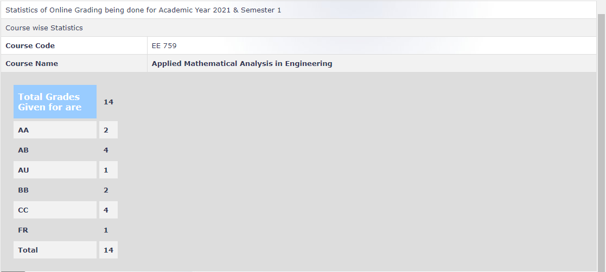

**Review by :** 

Kushal Kejriwal - EE DD 2024

**Course Offered In :**

Autumn 2021-22

**Instructors :**

Prof Jayakrishnan Nair 

**Prerequisites :**

None

**Difficulty :**

2/5 (5 being the most difficult)

**Course Content :**

Sets and numbers. Limits: sequences, convergence, Cauchy sequences, limit points, limsup, liminf, subsequences. Convergence of inifnite series. Applications. Normed spaces, completeness, Banach space. Inner-product spaces, Hilbert space. Applications. Continuous functions: continuity, left/right continuity, uniform continuity, intermediate value theorem. Applications. Fundamentals of topological spaces, compactness, connectedness. Topological groups. Applications. Differentiation. Inverse function theorem. Applications. Integration: Riemann integration. Lebesgue measure, Lebesgue integration. Applications. Function spaces, convergence of functions. Applications.

**Feedback on Lectures :**

Initially the prof gave recorded lectures, but since the batch was small, he asked for everyone's opinion and switched to live lectures later. Due to small batch size, the lectures were quite interactive and the prof explained the topics really well. He also gave written notes like he usually does for all his courses which were quite helpful.

**Feedback on Evaluations :**

There were around 4 quizzes (not sure) along with a midsem and endsem. There were also few graded assignments and tutorials given. The midsem and endsem mostly had questions from the assignments and tutorials and hence diligently solving these were enough to do well in the exams.

**Study Material and References :**

Not sure, there was one from Ross

**Follow-up Courses :**

None, probably some from the math department. (Not sure)

**Final Takeaways :**
The course is really interesting if you are into real analysis and like MA105 (Calculus) in your first year. Although it has some overlapping topics, it is not exactly the same and the prof explains the material really well.

**Grading Statistics :**

