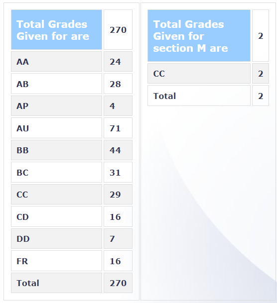

**Review By**

E Abhishek

**Course Offered In**

Spring 2022

**Instructors**

Prof. Amit Sethi

**Prerequisites**

None

**Difficulty**

3/5

**Course Content**

Regression, Classification, SVM, Neural networks, CNNs, Decision trees, Clustering and PCA. 

**Feedback on Lectures**

The professor was very enthusiastic about teaching the concepts. Still, he chose the flip classroom model due to the large class size (~400 students). The recorded videos from last year were used as the primary material for the course. These short videos covered most introductory ML concepts at the surface level. The lecture slides were concise, so we depended on our notes to prepare for the exams. Doubt-clearing sessions were conducted to supplement the recorded lectures. These sessions could have been more helpful if the class size had been smaller.

**Feedback on Evaluations**

The course had three heavy assignments worth 33 marks, which required python knowledge. There were four quizzes worth ten marks in total conducted during class hours. These quizzes helped us to be in sync with the lectures. The midsem was out of 21 marks and had subjective questions intended to check the student’s understanding of fundamental concepts. The endsem worth 36 marks had only objective questions. Apart from these, we had to submit __weekly__ notes on Moodle, accounting for 10 marks. Grading was absolute, with cut-off points at multiples of 10 (90+ for AA). Overall the evaluation and grading were reasonable compared to any other EE course.

**Study Material and References**

Lecture slides are enough to get a decent score in the exams but in order to score high, one has to refer to some textbooks. The recommended textbooks were

1. [Pattern Recognition and Machine Learning by Christopher Bishop](https://www.microsoft.com/en-us/research/uploads/prod/2006/01/Bishop-Pattern-Recognition-and-Machine-Learning-2006.pdf)
2. [Understanding Machine Learning: From Theory to Algorithms by Shai Shalev-Shwartz and Shai Ben-David](https://www.cs.huji.ac.il/w~shais/UnderstandingMachineLearning/understanding-machine-learning-theory-algorithms.pdf)

**Follow-up Courses**

One can take up any ML-related courses after completing this course, as it covers fundamentals related to all domains in ML.

**Final Takeaways**

This course is designed to prepare 3rd-year UG and 1st-year PG students for placement exams in ML/ Data Science domains. So, if you are interested in research, this course may not be a good choice.

**Grading Statistics:**

