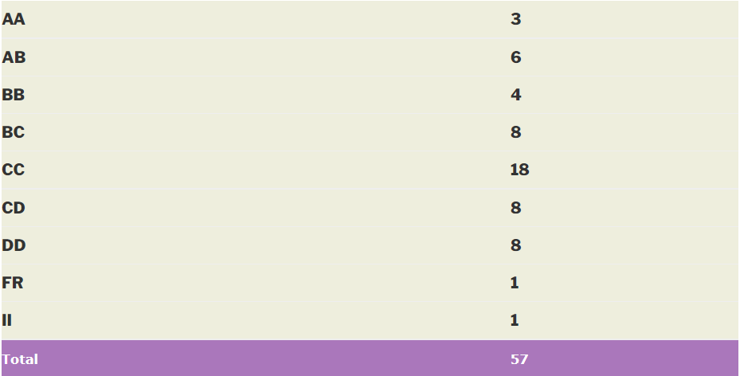

### EP 426 – PHYSICS OF QUANTUM DEVICES

**Course offered in:**

2014 – 2015 Spring

**Instructors:**

Prof. Kantimay Das Gupta

**Motivation for this course:**

Advanced level course on nano/micro scale devices and phenomena. Quantum treatment of electronic devices. Derivation of current in a variety of devices based on fundamental transport and gradient equations.

**Pre-requisites:**

Expected level by professor: QM1, QM2, Statistical and Thermal Physics. If not atleast EE207 is necessary..

**Course Content:**

1. Transport in large and small devices
- The Boltzmann transport equation (BTE)
- Using the BTE in simple cases
- What drives current

2. Electric potential, electrochemical potential, chemical potential, Fermi level…what are these?
- The band bending concept
- The self consistent band bending equations (Poisson-Schrodinger etc)
- Band bending near surfaces, interfaces
- MOSFET and the 2dimensional electron gas

3. Ballistic transport concept
- Application to 1D channels
- Quantum Hall effect
- Single electron transistor

4. Superconducting devices
- How a superconductor differs from a normal metal
- Josephson junction
- SQUID

5. A bag of topics..
- How are mesoscopic or nano-structures made?
- Using Quantum devices to define the standard Ohm/Volt/Ampere. How and why?
- Band structure of Si, Ge and GaAs.
- How shape of the Fermi surface is expected to change with electron concentration. Why metals have more complex fermi surfaces?
- various regions of the EM spectrum and length scales.

**Evaluation:**

Class Quiz : 10-15%
Mid sem : 25-30%
Class Quiz/Term Paper : 20-25%
End sem : 30-40%

Quizzes relatively easy compared to midsem and endsem

**Lectures:**

Difficult to follow instructions but professor encouraged extensive discussion for better understanding. The instructor used his lecture notes (descriptive but not spanning) as a background and explained crucial points on the board. Personal interaction possible due to small strength (40-50).

**Difficulty:**

5 on a scale 1-5.

**Grading Statistics:**

Lenient

Review by – Vivek Saraswat (13d070062@iitb.ac.in)
