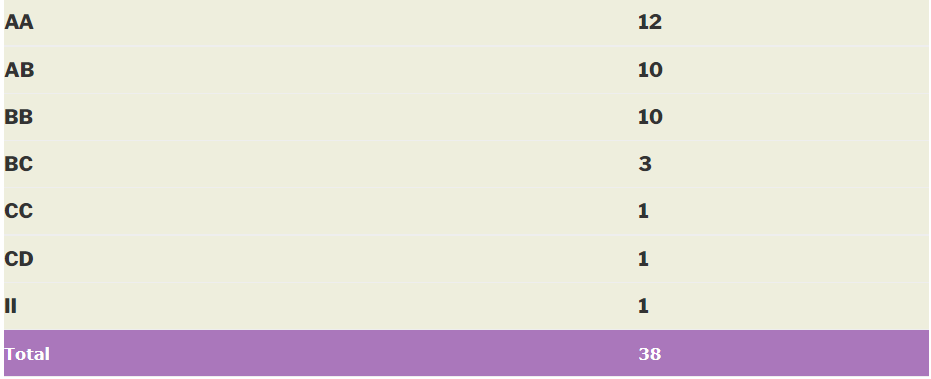

### ES 624 – HAZARDOUS WASTE MANAGEMENT

**Course offered in:**

2014 – 2015 Spring

**Instructors:**

Prof. Munish Chandel

**Motivation for this course:**

 It ran in my preferred slot 6 (empty slot for me). Though every other student took this course coz of good grading stats, I had taken up this course for my inclination towards learning about environment and government policies regarding environment conservation. The course fulfilled my expectation and included major Indian and US policies and Conservation Acts.

**Course Content:**

1. Hazardous Waste Fundamentals : Definition; Landmark episodes; Classification; Generation.
2. Regulatory process : Hazardous Waste (Management and Handling) Rules, Guidelines for HWM from MoEF, New Delhi, Regulatory framework in the USA and EU, Basel Convention and other international statutes.
3. Process Fundamentals : Physicochemical properties; Energy and mass balances; Fate and transport of contaminants; Toxicology
4. Current Management Practices : Environmental audit; Pollution prevention; Facility development and operations.
5. Treatment and Disposal Methods : Physicochemical processes; Biological processes; Stabilization and solidification; Thermal methods; Land disposal.
6. Remediation of Contaminated Sites : Quantitative risk assessment; Site and subsurface characterization; Containment, Remedial alternatives

**Course prerequisite:**

No pre-requisite, kind of basic introductory course.

**Feedback on lectures:**
Attendance constituted 20% marks with max 5 holidays allowed, so attending lectures was a must thing. Lectures were taught using slides which were shared after the class. Prof. Munish Chandel taught this course and he is a very student-friendly and kind hearted teacher. Attending classes were never boring as he always used to teach relating with stories and funny incidents. The content was simple and consisted basic terminologies of environmental studies.

**Feedback on assignments, tutorials and exam:**
There were no tutorials. Attendance was compulsory with 20% marks, end term was of 35% and midterm was of 25% with two quizzes of 5% each. 10% was allotted to term paper and its presentation.

Quizzes were objective while midterm and endterm included both objective and subjective questions. Exam difficulty level was easy and only slides needed to be referred for preparation. There were no tutorials.

**Overall Course Difficulty level:**

Moderate

**Grading Statistics:**

Easy

**Textbook and Reference:**
Slides are sufficient but reference book suggested by prof was Hazardous waste management by La grega

Reviewed by Ashirwad Gupta <gupta004ashirwad@gmail.com>
