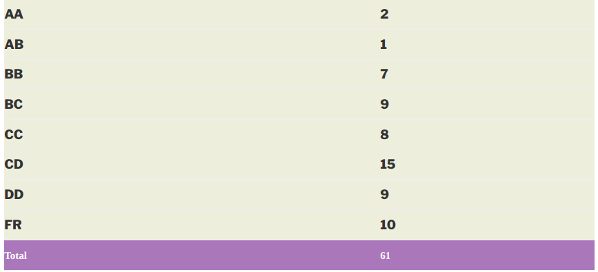

### PH 422 – QUANTUM MECHANICS II

**Course offered in:**

2014-15, Spring

**Instructors:**

Prof. Dipan Ghosh

**Course Content:**

A brief overview for this course is as follows :

* Review of Angular Momentum
* Angular Momentum Addition
* Wigner-Eckart Theorem
* Variational Principle
* Time Independent Perturbation Theory
* Time Dependent Perturbation Theory
* Scattering Theory
* Dirac Equation

**Prerequisites:**

Good understanding of concepts covered in Quantum Mechanics 1.

**Feedback on Lectures:**

Prof. Dipan Ghosh’s lectures were very crisp and easy to follow and the content covered was not very vast. He gave tutorials and solved some questions in class. There is no attendance requirement, but if you miss classes it becomes difficult to follow.

**Evaluation Method:**

Quizzes: 15 + 15

Midsem: 30

Endsem: 40

**Text Book:**

Detailed notes were provided for each topic covered in the course. You can refer to ‘Modern Quantum Mechanics’ by J. J. Sakurai and ‘Principles of Quantum Mechanics’ by R. Shankar

**Grading Statistics:**

**Miscellaneous:**

This course covers a lot of basic concepts that are routinely employed in device physics. Scattering theory is particularly useful. The angular momentum part is also quite fun and useful if you are interested in spin based devices. The course builds up on QM1, so be prepared to revise it. Solving the tutorials will help you a lot in doing well in the exams.

Review by – Yamini Bansal yamini63bansal@gmail.com

