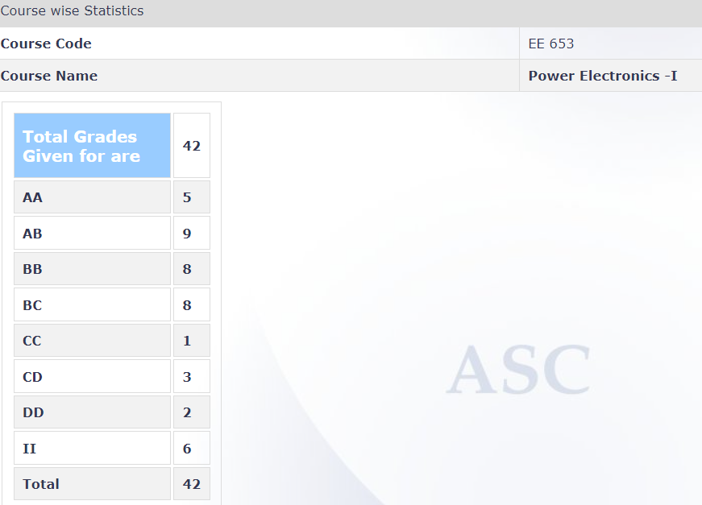

**Review by**
Immanuel Williams, EE DD PEPS 2018-2023

**Course offered in:**

Autumn 2021

**Instructors:**

Prof. Sandeep Anand

**Course Content:**

Review of line commutated converters, inverters, voltage control & Power factor improvement. power Devices : BJT, MOSFET, IGBT & GTOs - operating characteristics and gate drive requirements and circuits. Switched - mode rectifier: various Power circuit configurations & wave shaping techniques. Synchronous link rectifiers: Power circuit configurations, control techniques, application of these converters in load compensation, series compensators, multi level converters. inverters : voltage source inverters:- single phase & Six step inverters, voltage control & PWM strategies,and implementation aspects, Modification of power circuit for Four quadrant operation. Current source inverters: single phase and three phase power circuit configuration and analysis. Load commutated inverters: principle of operation, modification of power circuit configuration for low frequency operation. Phase Controllers.

**Prerequisites:**
No prerequisites are needed for this course as it is an elementary level course in power electronics.

**Feedback on Lectures:**
The lectures are highly informative and the instructor puts in a lot of effort in conveying key concepts. 

**Feedback on Tutorials, Assignments and Exams:**

The exams for this course can be quite tough as some aspects of design may also be brought into the picture. However, there may be a few simulation based assignments which are very useful and easy to score marks. 

**Difficulty:**
This course is not too easy to sail through but at the same time, not too difficult either. As it is an introductory course on power electronics, certain design aspects related to converters may be covered which would be very helpful in the later courses so this might pose a challenge initially as some real-world problems are tackled in this.

**Study Material and References:**

A good reference book for this course: Power Electronics: Converters, Design and Applications by Ned Mohan, Tore M. Undeland and William P. Robbins. 

**Follow-up courses**
Sequel course: EE654 (Power Electronics - 2), other follow-up courses: EE791 (Power Electronic Converters for Renewable Energy) EE660 (Application of Power Electronics to Power Systems) EE675 (Microprocessor Applications in Power Electronics), courses that may be done in parallel with this: EE657 (Electric Drives), EE673 (Power Electronics and Power Systems Lab)

**Takeaways from the course:**
As this is a PG level introductory course on Power Electronics, it is a really great course to explore further avenues of growth and specialisation with regards to the specific application of the PE converters. It is required that one does this course first before venturing into any of the other advanced courses in Power Electronics.

**Grading Statistics:**

