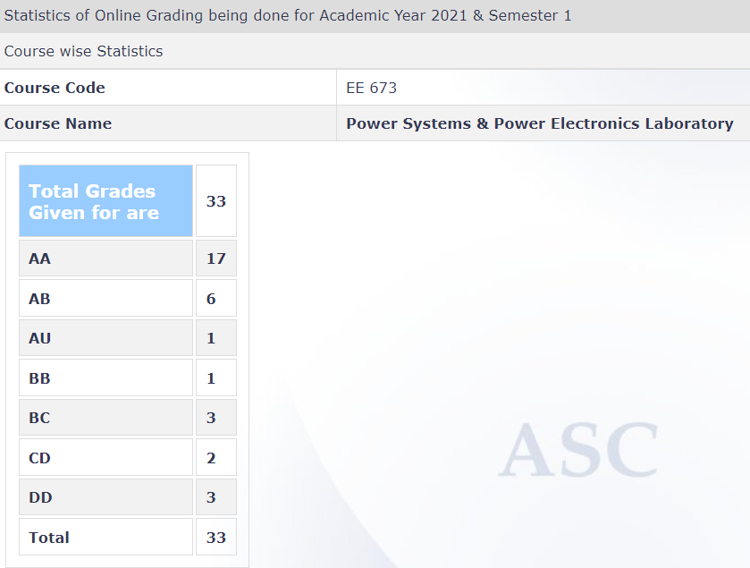

**Review by**
Immanuel Williams, EE DD PEPS 2018-2023

**Course Offered In**
Autumn Semester

**Instructors**
Prof. Anshuman Shukla and Prof. Anupama Kowli

**Prerequisites**
No official prerequisites, although it is recommended that this course is done in tandem with a foundational course like EE653.

**Difficulty**
As it is a lab course, it can be quite difficult, considering that there are design related problems that have to be tackled. However, these problems are what make this course truly interesting as they make the practical aspects of the theory learnt in other courses, more apparent.

**Course Content**
This is a laboratory based on computer simulation and hardware experiments consisting of computer simulation experiments on power systems and power electronics and hardware experiments on power electronics.

 
**Feedback on Lectures**
No lectures as such although tutorials on software tools are done which are very important in doing all the experiments and lab projects if any.

**Feedback on Evaluations**
There are group vivas for each design project or lab experiment and individual marks are given according to the viva performance and lab reports.

**Study Material and References**
NA

**Follow-up Courses**
NA

**Final Takeaways**
As this is a PG level lab course, it will cover some design related problems so it is recommended to do a theory course in tandem with this course to better appreciate the theory content and apply the same in this course.

**Grading Statistics:**

