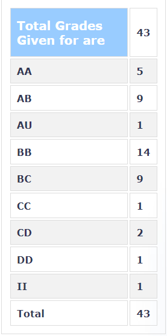

**Review by**

Tejas Bhalla, 2023(BTech)

**Course Offered In**

Spring 2022

**Instructors**

Prof. Anupama Kowli

**Prerequisites**

None. Understanding of HS 101 will help though. 

**Difficulty**

2/5 

**Course Content**

The course covers the following topics-
- Models for restructuring: extent of competition, perfect/imperfect competition, pool/bilateral trade 
- Review of basic concepts from microeconomics: demand/supply curve, market equilibrium, welfare theorems 
- Introduction to optimization: linear programming, duality and shadow prices 
- Market mechanisms: spot markets, forwards contracts, futures, options and swaps

**Feedback on Lectures**

The lectures are easy to follow with ma'am putting a lot of effort to ensure everyone understands the concepts being discussed. The content covered is easy enough to understand at an undergraduate level, with basic understanding of HS 101 and some basics of optimisation making the course significantly easier to comprehend.

**Feedback on Evaluations**

1. 30% Quizzes (Best 2 out of 3) The quizzes were fairly easy and could be easily solved in half of the given duration.
2. 40% Collab Assignments (4 assignments): These were assignments which had to be done in groups of 4 and generally involved solving optimisation problems in either MATLAB or Python. The first 2 assignments were more based on optimisation, while the last 2 were more based on data analysis.
3. 30% Individual Written Assignments: These assignments were simple problems very similar to the ones covered in class and also HS 101.

**Study Material and References**

- Fundamentals of Power System Economics, by Daniel Kirschen and Goran Strbac

**Follow-up Courses**

EE 655, Computer Aided Power System Analysis can be done as a follow up course if the course interests you.

**Final Takeaways**

This course is not a typical electrical engineering course and instead is a little more focused on the economic aspects and is a nice breath of fresh air being offered in the department.

**Grading Statistics:**

