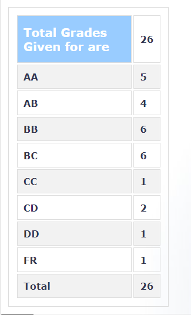

**Review by**
Dishank Jindal 2023(BTech)

**Course Offered In**
Autumn 2021

**Instructors**
Prof. S. A. Soman

**Prerequisites**
N/A

**Difficulty**
2/5

**Course Content**
First half of the course till the midsems focussed on laying the foundation of optimisation in real life sceanrios. A few examples were discussed and existence of minimum, local and global minimum, weistrass theorem were covered. Geometric optimisation, AM-GM, and a few simple methods were also taught. Second half of the course covered proper formalisation of optimisation problems (mostly convex optimisation). 

**Feedback on Lectures**
Pre-Recorded lectures were given. The frequency and duration of lectures were quite less till the midsems but after that some heavy lectures were sent out by sir. The lectures were quite slow paced overall and easy to understand. 

**Feedback on Evaluations**
2 assignments, 2 quizzes, Midsem and Endsem.
Midsem and assignments were subjective whereas quizzes and endsem were objective.
All the questions were easy to medium level and could be solved based on material taught in class. 

**Study Material and References**
Sir doesn't hand out notes or slides. You have to ake our own notes.
Books: Rangarajan K. Sundaram, A First Course in Optimization

**Follow-up Courses**

**Final Takeaways**
The course couldn't cover everything mentioned on ASC, the content covered was far less and on the easier side compared to the one taken by Borkar sir. Overall, the courdse gave a good start to optimisation.

**Grading Statistics:**

