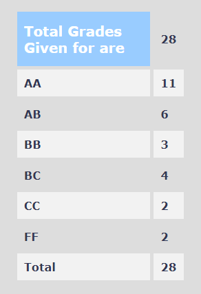

**Review by**

Adway Girish, 2022 (B.Tech.)

**Course Offered In :**

Autumn 2021

**Instructors :**

Prof. Vivek Borkar

**Prerequisites :**

An introductory probability course (such as EE 325) is a prerequisite. Since this is offered in the autumn semester, sophomores cannot take this course as they would not have done EE 325. 

**Difficulty :**

9/10. It takes a good deal of effort to understand the rigour-heavy content, subject to your mathematical background and prowess.

**Course Content :**

This course is an introduction to measure-theoretic probability. The topics themselves will be familiar to most students from their introductory probability course, but the treatment is far more rigorous and formal. The contents are: probability spaces, random variables, expectation, limits and convergence of random variables, independence, conditional expectation, martingales, and Markov chains. The measure-theoretic framework is evident from the very first lecture and this cumulatively builds throughout the semester (as with all mathematical courses). Quickly identifying the necessity of such a framework in probability is key to making the most of this course in terms of understanding.

**Feedback on Lectures :**

The lectures are fast and cover lots of heavy content, which makes it difficult to understand everything that is discussed at the first attempt. Digressions (technical or otherwise) are frequent and while they may sometimes be complicated and hard to follow, they keep the class interesting.

**Feedback on Evaluations :**

There were no assignments, and the tutorials were previous years' exam papers (solutions were provided). As for the exams themselves, we were allowed to refer to notes, books, and even the internet (though we were warned that it would only be detrimental). The questions are short, easy and straightforward if one knows exactly what to use (which is non-trivial given the volume of content covered).

**Study Material and References :**

The slides are well-detailed. Since this is an introductory course, there are several classic texts. These can be referred to for more details on a specific topic, but it is best to follow the lectures and slides in general, since they contain all of the relevant information. Here are some standard references:

1. Billingsley, P. (1979). Probability and measure. New York: John Wiley.
2. Breiman, L. (2007). Probability. Philadelphia: Society for Industrial and Applied Mathematics.
3. Rosenthal, J. S. (2016). A first look at rigorous probability theory.
4. Tucker, H. G. (1967). A graduate course in probability.
5. Freedman, D. (2012). Markov chains. Springer.

**Follow-up Courses :**

In general, any course that is an application of probability can be taken after this. In particular, EE 736: Introduction to Stochastic Optimization (typically offered by the same instructor) is one. While most courses may not use the measure-theoretic framework to aid those who have not taken this course, it is still a valuable asset to have (e.g. references may not shirk using the formal generalisation that is measure theory).

**Final Takeaways :**

This course sets up the fundamentals of measure-theoretic probability. Anyone looking to work in applied probability should definitely take this course. Anyone interested in math, particularly analysis, will find this course interesting.

**Grading Statistics:**
