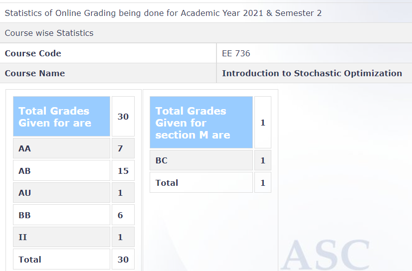

---
layout: page
title: EE 736 – Introduction to Stochastic Optimization (2021)
cover-img: assets/img/Cover_study.jpg
thumbnail-img: ""
share-img: ""
comments: true
tags: [Elective, Probability, Optimization]
---

**Review by** 
Shaan Ul Haque, 2022 Btech

**Course Offered In:**
2021 Spring Semester

**Instructors:**
Prof. Vivek Borkar

**Prerequisites:**
Probability and Random processes, Advanced Probability and Random Processes.

**Difficulty:** 
5

**Course Content:** 
The course covers 4 main topics- Stochastic Approximation, Monte Carlo Markov Chain, Markov Decision Process and Reinforcement Learning. Apart from this there might be some side topics which the Prof might take if time allows. There is also a course project which is simply report making of a research paper.

**Feedback on Lectures:**
The Prof has a different style of teaching which might take a week or two to sync with. But once adapted, the lectures become understandable. The toughest part is stochastic approximation but after that the intensity of maths goes down. Highly recommend revising the lecture slides because all the lectures are highly interconnected. 

**Feedback on Evaluations:** 
There are two exams midsem(35%), endsem(40%) and report making(25%). The weightage might change. Both exams demand a very good and deep understanding of the lecture. Exams were open book and anything was allowed including internet although the Prof warned that it will be of no use. A good command on the proving techniques, used in the lecture slides, is highly beneficial. Usually, the answers are half a page small and only require correct identification and application of theorems proved in class. Report making was very easy and the Prof. takes into account the interest of the student before giving the research paper. Grading is very lenient and can be checked on ASC. 

**Study Material and References:** 
Course slides. Books will not help as no book follows the pattern and style in which the Prof teaches. Moreover, slides are actually notes from Prof's own book.

**Follow-up Courses**
None

**Final Takeaways**

**Grading Statistics:**

