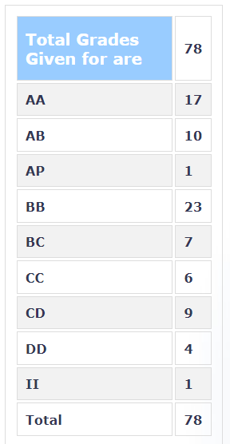

**Review by**

Aditya Anavkar, 2023(BTech.)

**Course Offered In**

Spring 2022

**Instructors**

Vikram Gadre

**Prerequisites**

No prerequisites required

**Difficulty**

2/5

**Course Content**

Basics of digital signal processing is covered along with few advanced techniques. The content covered is as follows
1. Sampling theoram, Aliasing, Discretization of the dependent variable, Difference equations
2. Discrete time systems and their properties
3. DTFT and Parseval's Theoram
4. Z transform
5. Efficient computation of the Discrete Fourier Transform
6. Digital Filters and their general characteristics
7. Finite Impulse Response (FIR) Filters and their design
8. Infinite Impulse Response (IIR) Filters and their design
9. Realization of Discrete Time systems

**Feedback on Lectures**

All the course material was already uploaded on NPTEL for the students to view at their own pace. The videos uploaded on NPTEL are pretty concise, and the instructor takes his time to explain the concept in detail. The students were expected to form groups of 3 amongst themselves, and during the live lecture one/ more than one group would be required to present and explain the lectures as seen on NPTEL. While the lecture is presented by students the instructor does point out any addition that needs to be made and clears any doubts from students. Along with this, the instructor 
would ask "pop questions" each lecture and award "pop marks" for the first few students who would answer it. Marks would be awarded to the group for the lecture they presented.

**Feedback on Evaluations**

The evaluation for the course consisted of two parts - Part 1 and Part 2.  
The Part 1 consisted of Mid sem (30M), course project +endsem (80M), Mandatory Filter design assignment (40M).  
Part 2 consisted of posting new problems, echo and explain (live lectures), Optional Filter design assignment (40M), solution to tutorial problems, solution to challenge problems. Along with this, the pop points awarded during the lecture were also accounted for. 
 There were no quizzes; the midsem was conducted two times once online, and once offline , with offline having questions on the linient side since it was a timed test whereas the online was a take-home exam. Each of them had 3 questions, students were allowed to attempt both, in which case best 3 of 6 questions were counted. The end-semester exam was based on the group's end semester project. 
Grading was done by the following policy: the score in Part One could entitle the student to a grade up to and including 'BC', or 7 grade points. Promotion to grades BB, AB, 
AA and AP or no promotion, was then based on a Part Two score.

**Follow-up Courses**

EE 678 Wavelets can be taken up by students if they are interested in exploring idea of time frequency localization.

**Final Takeaways**

Consistent efforts are required in this course and the instructor is also mindful about your efforts throughout the semester. Both the part 1 and part 2 are accounted for grade calculation and thus it would make it relatively easier for you if you attempt the optional part from the start.

**Grading Statistics:**

