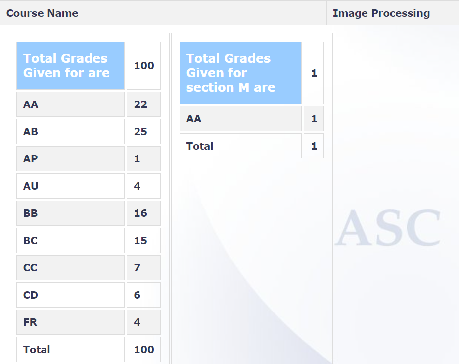

**Review by**

Mitali Meratwal, 2023(BTech)

**Course Offered In:**

Autumn 2021-22

**Instructors:**

Prof. Amit Sethi

**Prerequisites:**

None but concepts from EE229 (Signal Processing-I) like fourier transform are useful.

**Difficulty:**

3/5 The course was slightly on the easier side as compared to other mathematically heavy electives in the department.

**Course Content:**

1. Digital image fundamentals
2. Histogram manipulation
3. Spatial filtering
4. Frequency filtering
5. Wavelet filtering
6. Color spaces and color processing
7. Compression
8. Morphological ops
9. Segmentation and shape detection
10. Image descriptors
11. ML for images
12. CNNs for classification
13. FCN for image mapping
14. Object detection
15. Image generation

 The last ML topics were covered from an application point of view rather than underlying theory which was just discussed briefly.

**Feedback on Lectures:**

The lectures were well structured and succinct. The professor used many visual examples to reflect differences between various image processing techniques. Slides were mostly adapted from the reference book and the professor gave detailed explanations wherever needed. Maintaining notes from the beginning is helpful since endsem was open notes and also saves time in going through reference again. Some topics like wavelets were difficult to comprehend without any prior background but did not have large weightage in the exams.

**Feedback on Evaluations:**

The course had two assignments and a project apart from weekly notes submission which contributed to evaluation outside midsem and endsem. The first assignment was on creating a GUI for image editing supporting multiple transformations. Second assignment was on image restoration using machine learning techniques. Both assignments were interesting and gave freedom to try new things apart from the problem statement.
Midsem was moderately difficult and one cheat sheet was allowed, while majority of the students found the endsem to be easier.
Professor encouraged project topics that combined techniques from multiple assignments across a wide range of subject areas while avoiding making it all about ML/DL.
Weightages (incl. bonus):

1. Notes: 5
2. Assignment1: 11
3. Midsem: 21
4. Assignment2: 11
5. Project: 20
6. Endsem: 30
7. Project Proposal: 3

Absolute grading scheme was followed with grade splits at multiple of 10 (90, 80…etc.)

**Study Material and References:**

Digital Image Processing, 4th Ed by Rafael Gonzalez (Author), Richard Woods (Author)
Dive into Deep Learning https://d2l.ai/

Gonzalez and Woods is the bible of this course and is highly recommended to get a clear understanding of the topics.

**Follow-up Courses:**

1. Computer vision (EE702, CS763)
2. Advanced Image Processing (CS754)
3. Medical Image Computing (CS736)

**Final Takeaways:**

The course is really interesting for anyone interested in signal processing, traditional image enhancement techniques and is highly application based with intuitive and mathematical reasoning rather than abstraction. Image processing has an intersection with medical image analysis, computer vision, compressed sensing, human vision perception, to name a few and this course can give a glimpse of the ongoing research in some of these fields which one might want to explore further as part of BTP or RnD.

**Grading Statistics:**

