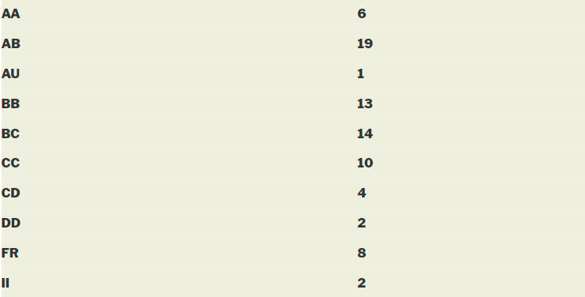

### EE 708 - Information Theory and Coding

**Course offered in:**

Spring 2014-2015

**Instructor:**

Prof. Bikash Kumar Dey

**Motivation:**

The motivation of the course is that a student, at the end should :

* Understand and appreciate how information theory is concerned with the fundamental limits of communication: both ultimate limit to data compression, and ultimate limit of reliable communication over a noisy channel
* Understand how coding theory is concerned with techniques to realize the limits specified by information theory, and learn some practical techniques of source coding and channel coding.
* Get an idea of the broad areas information theory is used in today’s world, from statistics, data analysis, cryptography, etc., and how development of information theory and coding theory has been crucial to the development of communications as we know it today, and many other things.

**Course Content:**

The official content is here: http://www.iitb.ac.in/acadpublic/crsedetail.jsp?ccd=EE%20708. It is followed to quite a large degree.

Introduction to entropy – The course starts with an attempt to answer the question, what is information, and how can it be quantified, and how entropy is the natural answer to this fundamental question. It then moves on to study of relative entropy and mutual information, and inequalities related to the same.

Data Compression – This is probably the easiest to visualize part of the course. It starts with how the objective of source coding is to represent the source at a lower rate, and is followed by a discussion of various methods of source coding, and results related to the same.

Asymptotic Equipartition Property(AEP) – This part of the course is covered at about before and after the midsems. This is a discussion of how AEP gives us typical sets, and how can that be used in source coding.

Channel Capacity and Channel Coding – starts with mathematical, and operational definitions of channel capacity, and how it can be computed for arbitrary channels. The channel coding theorem, and its proof, as given by Shannon are discussed.

Gaussian Channels – The course ends with a discussion of the most important channel, the Gaussian channel, proof of its capacity under power constraints, and the water filling method, for parallel gaussian channels.

**Pre requisites:**

There are no prerequisites as such, but a basic understanding of probability theory is expected. EE 325 (Probability and Random Processes) is thus in a way necessary, or else quite some extra effort would be needed.

**Feedback on lectures:**

Most lectures are fairly interesting (especially initially), and are easy to follow. After the initial few weeks, it gets somewhat dull, and seems repetitive, but following them is very helpful at the end of the course.

**Feedback on tutorials, assignments and exams:**

We had a tutorial almost every week, in which interesting problems, many of which we have heard at some point of time or the other are discussed, and solved, using principles of information theory, which is very surprising, and interesting. Sir is enthusiastic about clearing doubts in class as well as in tutorials. The exams aren’t too difficult, provided one has followed the course, and done the practice assignment, which is generally from the prescribed textbook for the course – Cover and Thomas.

**Study Material and References:**

The prescribed textbook is Elements of Information Theory, by Cover and Thomas.

Other textbooks are textbooks on information theory by Robert Asch, and David Mackay, the latter of which is also available online.

**Advanced Courses that can be taken after completing this course:**

EE726: Advanced Information Theory and Coding

**Grading Statistics:**

Reviewed by **Kush Motwani (kushmotwani1@gmail.com)**