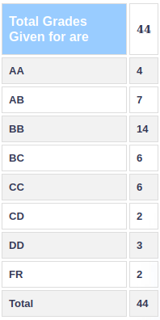

**Review by**

Sheel Shah, 2023 (BTech)

**Course Offered In**

Autumn 2022

**Instructors**

Sibi raj pillai

**Prerequisites**

none

**Difficulty**

4 (fairly tough)

**Course Content**

See ASC. Mainly revolves around optimal coding in the first half, and
capacity of different types of channels in the second half.

**Feedback on Lectures**

The lectures were incredible and the topics interesting. Sibi sir is
quite passionate about teaching and is extremely patient with everyone's
doubts etc. there were regular tutorials too that were discussed in
class. The course had a great flow to it in general.

**Feedback on Evaluations**

The quizzes were easy, and so were the assignments. The assignments did
take some time though. The midsem and endsem were difficult. The midsem
was so difficult that a lot of the class got single digit marks (out of
35) and sir conducted a re-midsem on a smaller syllabus. The exams had
non-trivial 'thinking' problems that relied on a sound understanding of
the course's content.

**Study Material and References**

There are two books (one for each half) that sir recommends with really
good practice problems.

1. Elements of Information Theory, T.M. Cover and J.A.Thomas, Wiley 1991 
2. R. G. Gallager, Information Theory and Reliable Communication, Wiley, 1968.

**Follow-up Courses**

Ee605 (error correcting codes)

**Final Takeaways**

I had a lot of fun in this course, minus the exams. I really enjoyed
Sibi sir's lectures, and after the exams were over, I also appreciated
how good the questions were. I recommend the course if you like
math/logic.

**Grading Statistics:**

