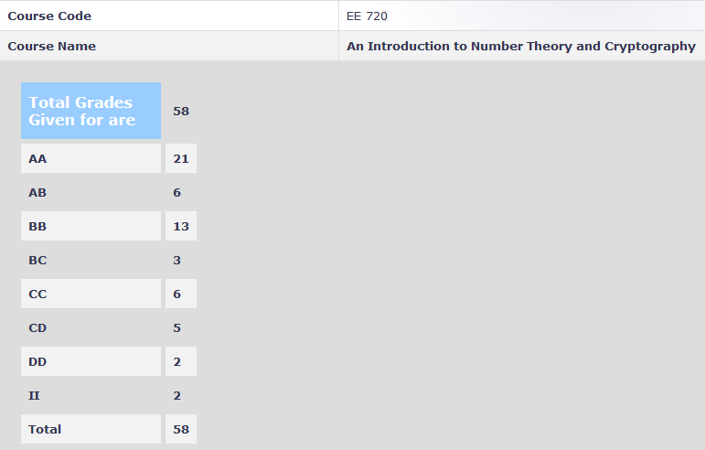

**Review by**

Puranjay Datta, 2024 (DD)

**Course Offered In**

Autumn 2021

**Instructors**

Prof. Virendra R. Sule

**Prerequisites**

There are no hard prerequisites for this course

**Difficulty**

3/5 (on a scale of 1-5 with 5 being very tough)

**Course Content**

1. Public Key Cryptography
2. Feedback Shift Registers
3. Stream Generators 
4. Finite Fields
5. Euclidean Division
6. Block Cipher
7. Sage Computation
8. Stream Cipher Models
9. Factorization and Discrete Log Computation
10. Hash Functions
11. Digital Signature
12. Attacks on RSA

**Feedback on Lectures**

Lectures were held in online mode and were moderately paced with enough time given for explaining the mathematical computations. A thorough understanding of the slides was sufficient to score a good grade in the course, though reading up the concepts from reference books is recommended to have a firm grip on the concept.

**Feedback on Evaluations**

1. Midsem (30% - Take Home due to Online Semester)
2. Endsem (50% - Take Home due to Online Semester)
3. Project (20% - Implement a cipher using Sagemath)

The Questions asked in the exams were similar to the past exam papers and examples taught during the lectures and hence were on the easier side.

**Study Material and References**

In addition to slides, one can refer to the following books:

1. Introduction to Cryptography: With Coding Theory - Book by Lawrence C. Washington and Wade Trappe
2. Introduction to Cryptography, Author: Johannes A. Buchmann
 

**Follow-up Courses**

EE793 - Topics in Cryptology

**Final Takeaways**

This is an Introductory Course in the field of Cryptography and lays the foundation for Cryptanalysis. The course is not demanding and you can get a reasonably good grade (AA, AB) if you attend the lectures regularly.

**Grading Statistics:**

