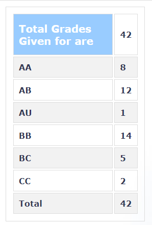

**Review by**

Prathamesh Dhake, 2023(BTech.)

**Course Offered In**

Spring 2022

**Instructors**

Prof. Virendra Sule

**Prerequisites**

N/A. Knowledge of EE720 (An Introduction to Number Theory and Cryptography) would be beneficial but not compulsory.

**Difficulty**

3/5 Moderate course

**Course Content**

The course started with a recap of what classical ciphers are, ciphers such as Vigenere Cipher, Diana Pad, One Time Pads, etc, followed by what stream generation is and how is it generated. We studied the core principles of encryptionand the concept of perfect secrecy. Following this, we studied some basic mathematics such as fields, field extensions, rings and basic mathematical overview of AES cipher. Continuing this, we studied Theory of Boolean systems of equations and solutions: Boolean elimination theory, Implicant based parallel all solution solver, orthogonal systems, and Satisfiability and algorithms for CNF-SAT. 

Post midsem, we focused more upon the research by the professor. We began with the concept of Local Inversion and then studied the application of this in the BlackBox approach to Cryptanalysis proposed by the professor. 

SageMath, a free open-source mathematics software, was utilized throughout the course, a small tutorial was provided by the professor. It is quite similar to python and is therefore not very difficult to learn. 

In conclusion, the pre-midsem section of the course was summarizing basic ciphers, providing a basic mathematical basis for the field, and delving into boolean algebra. The post-endsem section was an insight and a study of the approach developed by the professor for cryptanalysis of encryption algorithms. The course was accompanied by a home assignment which demanded a partial implementation of the Black Box Approach discussed by the professor
 
**Feedback on Lectures**

Initially the course was conducted online with slides and regular live lectures. Sometimes the lecture flow could be felt to be a bit too fast but the professor slowed down if requested. Post midsem, the course mostly moved offline with offline lectures. The slides for the lectures were provided, albeit late. In my opinion, attending the offline lectures helped, since the examples described in the class where not included in the slides provided.

**Feedback on Evaluations**

1. 30% Assignment
3. 30% Midsem
4. 40% Endsem

Around the beginning of March, we were given a writeup for the assignment. It was supposed to be done in teams of 2, with the submission deadline just before the endsems. The assignment was computationally heavy so, would be recommended to start atleast a week before the deadline. The background required for the assignment was available in the write-up provided and supplemented by the post-midsem content of the course.

The midsem and endsem examinations were open book, but internet allowed only for accessing SageMath documentation. The questions being very similar to the ones available in the practice problems provided, and quite a few being very similar to the previous year examinations. 

**Study Material and References**

The lectures are mostly self-sufficient. One can read the papers published by the professor for a greater understanding.

**Follow-up Courses**

CS741 - Advanced Network Security and Cryptography

**Final Takeaways**

If one is looking forward to take this course to get a detailed understanding of algorthms, how they're designed, how attacks work among other things, unfortunately, this course does not cover those aspects in this field, rather provides a minimal mathematical background for doing so. It is a great way to be introduced to be research conducted by the professor, if one is interested.

**Grading Statistics:**

