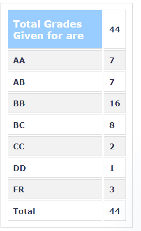

**Review by**
Ashutosh Ranjan, 2023(DD, Micro)

**Course Offered In**
Autumn 2021-22

**Instructors**
Prof. Jayanta Mukherjee

**Prerequisites**
No Hard Prerequisites, A basic circuits course and introduction to network theory, and some familiarity with Maltab/scilab will do.

**Difficulty**
Medium, On a scale of 10 I would give it 7/10.
Requires the effort of attending classes regularly, practising derivation, reading book too! Derivation questions has come directly from the textbook.

**Course Content**
Section-1:
Passive devices used in microwave systems,
Distributed circuit theory,
Brief about EM waves, Group velocity & Phase velocity concepts,
Tx line equations, Losses in Tx lines, Impedance calculations, 
Quarter wavelength transformer, Bandwidth Analysis, Reflection coefficients, Smith Charts, Multisection Txformer

Section-2:
Impedance Matrix, Properties of Loss Less and Reciprocal Devices, Scattering Parameters, Properties of S parameters, 2-port n/w properties,
Passive devices, 1,2,3,4-port devices, Resonators, Capacitively coupled resonators, Gap Coupled resonators,
Band Stop and Band Pass Filters, Multisection Bandpass Filter, Higher Order Bandpass Filter, Direct Coupled Filters,
Stepped Impedance FIlter, Commensurate Filter Design, Filter Prototypes, Scaling of prototypes,

Section-3: (may or maynot be covered - depends on time, In my case it wasn't covered)
Signal Flow Graphs, Amplifier design, About Active devices.

**Feedback on Lectures**
Professor takes lectures using slides and whiteboard both. He shows the analysis and derivation of the forumula using the whiteboard. Taking notes for those derivations is strongly recommended. Ask doubts he explains them well. He is kind enough to go through the entire derivation once gain if you don't understand.

**Feedback on Evaluations**
There were 2 quizzes (15% each), midsem (20%), endsem (30%) and a project (20%). Professor sometimes hints on the question which can be asked in exams. So, missing classes will cost you if you want to earn a good grade. Exams involved calculations of quantities, derivation and explanations of fundamental understanding of certain concepts. Pracising from books can be helpful because derivation question have been asked directly from the textbook, here I am referring to the text for explaining concepts and not the exercises questions. All the exams are graded by the TAs and the project is graded by the professor himself.
Project is design some circuit (having application in microwave area) by reading reference papers in ADS (Advanced Design System) Keysight Technologies.

**Study Material and References**
1) Pozar David M. Microwave Engineering (primary)
2) Peter A. Rizzi, Microwave Engineering (reference)

**Follow-up Courses**
EE614 Solid-State Microwave Devices

**Final Takeaways**
If you want to explore some concepts about Microwave theory, Microwave Frequencies typically range from 0.3 to 30 GHz which means Wavelength in free space varies from 1m to 1mm. Your important frequency bands lies in this area like GPS 1.5 GHz, Bluetooth ISM band (ISM: industrial, scientific, and medical radio band) 2.4 GHz, microwave oven 2.45 GHz etc(Numbers are not exact but anywhere near them). Concepts learnt may have application in the hot field nowadays like mmWave because you see, one end of the wavelength approaches mm length scale.  

**Grading Statistics:**

