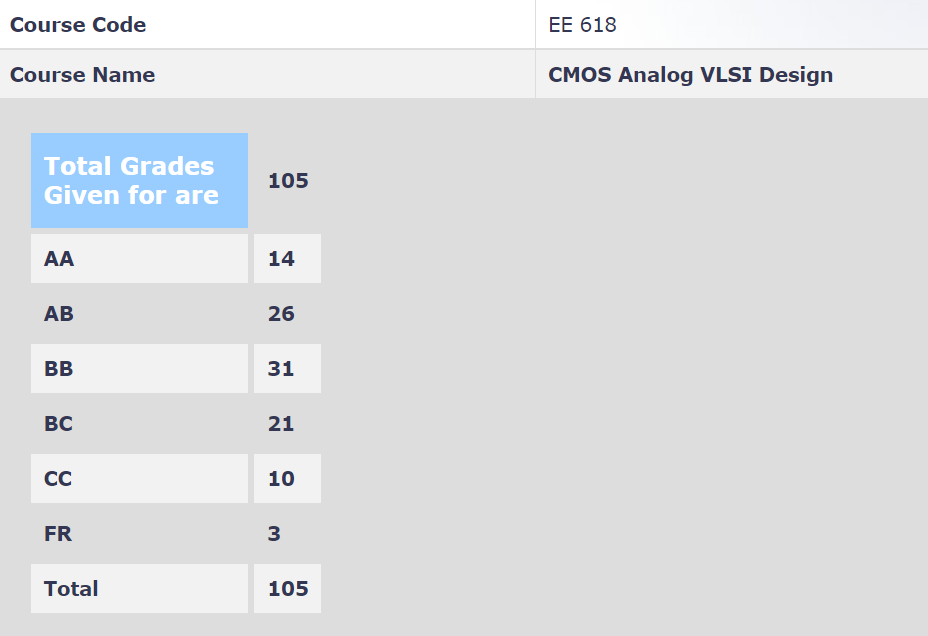

**Review by**

Suraj Sarvesha Samaga, 2023(BTech.)

**Course Offered In**

Autumn 2021

**Instructors**

Prof. Maryam Shojaei Baghini

**Prerequisites**

EE204 - Analog Circuits

**Difficulty**

5/5 Very intense course

**Course Content**

The course started with a recap of MOSFET device physics and the small-signal MOSFET model, followed by the various transistor configurations (common source, common gate, source follower, cascode, folded cascode). Then followed a discussion on Current Mirrors and this encapsulated the topics until midsem. 

Post midsem, we began with Differential Amplifiers with active and passive loads, after which the crucial topics of Frequency Response and Stability and Frequency Compensation were taken up - essentially reviewing stability criteria and phase margin for a circuit, and then delving into circuit techniques to affect frequency compensation and pole placement.  

In conclusion, an introduction to Noise Analysis and Noise in the specific cases of Single Stage Amplifiers and Diff Pairs were discussed. The course was accompanied by a demanding course project involving designing an Operational Transconductance Amplifier with Slew-Rate Boosting.
 
**Feedback on Lectures**

We were asked to watch and review video lectures from the YouTube playlist of Ali Hajimiri, which were then again discussed in class hours, where the important points were re-emphasized, and any extra-topics were covered. Attending lectures however felt like an onerous task at times and would occupy a good chunk of one's week. Each lecture clearly mentioned relevant sections in reference books, so even if lectures were at times hard to follow, one could fall back on the reference material.

**Feedback on Evaluations**

1. 15% Moodle Quizzes (best 4/6) 
2. 20% Assignments (5)
3. 20% Midsem
4. 20% Endsem
5. 25% Course Project

Every thursday at 9PM, there would either be a tutorial, or a Moodle quiz. The Quizzes and Assignments had a fair level of questions dealing with concepts taught until then. The tutorials were quite helpful in solving assignments and understanding course content in general. The Midsem was very difficult, with a bunch of hard questions and very less time to do them. The endsem was relatively better. Both were 1-hour exams.

The project involved understanding and assimilating a recent research paper on the design of an Operational Transconductance Amplifier and then implementing a similar sort of design on NgSpice to meet the target specifications. Help sessions for the same were conducted towards the end. The project deadline was kept right before the endsems, but was later postponed, to fall sometime during the endsem week. Starting early would prove beneficial here.

**Study Material and References**

1. Behzad Razavi - Design of Analog CMOS Integrated Circuits
2. Hajimiri_Analog_DRAFT012021 (PDF available on the internet) 

**Follow-up Courses**

EE719 - Mixed Signal VLSI Design

**Final Takeaways**

Maryam ma'am discourages Third-year students from taking up this course due to lack of commitment from their part, and the fact that this course tends to be on the heavier side.
This course however offers an introduction to various analog design techniques and is a part of the “analog trinity of courses” : 618, 619, and 719 - an essential set of courses to add to your repertoire if you want to go deep in analog. 

**Grading Statistics:**

