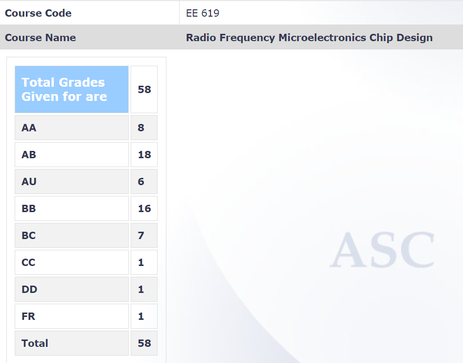

**Review by**

Suraj Sarvesha Samaga, 2023(BTech)

**Course Offered In**

Spring 2022

**Instructors**

Jayanta Mukherjee

**Prerequisites**

None officially, but it is recommended to have done EE204 and EE341 before taking up this course

**Difficulty**

3/5

**Course Content**

The course is a concoction of various topics in analog and communications. Starting with a detailed discussion on Non-linear systems and Noise Analysis, and an overview of modulation and detection, we reach the most important topic pre-midsem - Low Noise Amplifiers (LNAs) - their properties and various topologies. This is followed by a discussion on Transmitter and Receiver Architectures followed by the important topics of Mixers and Power Amplifiers. The course ends with Oscillator Models and Types and an introduction to Frequency Synthesizers.

**Feedback on Lectures**

The lectures are heavy on content and slightly dry. The professor uses slides of good quality to explain concepts and offers crisp explanations. The year I attended, the lectures were online for the most part. The class is taught at a fairly high pace, but the professor takes his time to clear doubts if any.

**Feedback on Evaluations**

- 2 Quizzes - 10% each
- Midsem and Endsem - 30% each
- Course Project - 20%

The course project was on the design of an LNA and supplemented the theory taught in class pretty well. The exams were mostly straightforward, the questions usually pertained to the concepts taught in class and there were seldom any mind-boggling questions.

**Study Material and References**

RF Microelectronics, Second Edition - Behzad Razavi

**Follow-up Courses**

I don’t think this course has any follow-ups per-se. One could do related courses like EE 611 - Microwave Integrated Circuits

**Final Takeaways**

This course is a part of the “analog trinity of courses”, 618, 619, and 719 - an essential set of courses to add to your repertoire if you want to go deep in analog. It serves as a very good introductory course to Analog RF design.

**Grading Statistics:**
