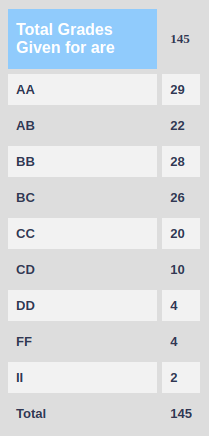

**Review by**  
Janeel Patel, 2023(DD)

**Course Offered In**  
Autumn 2021

**Instructors**  
Prof. Dinesh Sharma

**Prerequisites**  
There are no strict prerequisites as such. However, familiarity with topics such as MOS devices and digital circuits will be beneficial. The first few lectures cover these theoretical aspects in adequate depth. A prior exposure to circuit simulation using SPICE and hardware description languages such as VHDL or Verilog is also recommended.

**Difficulty**  
Moderate

**Course Content**  
- Design of logic gates
    - Different design styles for logic gates
    - Dynamic logic
    - Static and dynamic performance metrics
    - Parasitic elements, design rules and layout
- Storage circuits
- Design of multi-stage logic
- Semi-custom design
- Arithmetic circuits
- Semiconductor memories
- I-O circuits 

**Feedback on Lectures**  
The course content is carefully planned and organized. Lectures slides are used to explain concepts, and are fairly detailed. The instructor covers concepts in ample detail during lectures which is why it is advantageous to attend classes. The instructor is also available for doubts and discussion after every lecture. There is no strict policy regarding attendance in lectures. The professor conducts tutorial sessions to discuss numerical examples and solutions to examination problems.

**Feedback on Evaluations**  
The grading policy followed for the Autumn '21 offering of the course was:
- Quizzes     : 20% (2 x 10%)
- Assignments : 15% (4 x 3.75%)
- Midsem      : 25%
- Endsem      : 40%

The exams tested how well the student could apply concepts - both numerical and theoretical - covered in class. These exams were a bit lengthy but questions were mostly based on the material covered in lectures.  
Assignments involved circuit simulation using ngspice, and hardware design and verification using VHDL. The instructor provides an exhaustive set of resources to get (re-)acquainted with the tools and software used. The instructor also provides sufficient time, hints and pointers to get started with  assignments, and addresses all doubts (concering both, assignment work and examinations) satisfactorily.

**Study Material and References**  
The lecture slides and accompanying notes are elaborate and contain almost everything taught in the class.

Material in the following books complement the content covered in lectures really well:
- N. Weste and K. Eshranghian, “Principles of CMOS VLSI Design”, Addison Wesley, 1985
- Jan M. Rabaey, A. Chandrakasan, B. Nikolic, “Digital Integrated Circuits: A Design Perspective”, PrenticenHall/Pearson Education, 2003
- N. Weste, D.M. Harris, “CMOS VLSI Design: A Circuits and Systems Perspective”, Addison Wesley, 2011
- L.Glaser and D. Dobberpuhl, “The Design and Analysis of VLSI Circuits”, Addison Wesley, 1985

**Follow-up Courses**  
The content covered in this course is useful for VLSI circuit design in general, and courses like EE 668 (System Design) and EE 705 (VLSI Design Lab) in particular. This is a core course for DD students from the Microelectronics specialisation (EE4).

**Final Takeaways**  
EE 671 is a great course for anyone interested in the VLSI field or electronics, and covers various conceptual and pragmatic aspects of VLSI design in great detail. The pedagogical approach adopted by Prof. Sharma is excellent and comprehensive.

**Grading Statistics:**  

