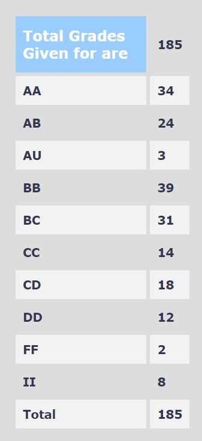

**Review by**  
Saketika Chekuri, 2023 (BTech)

**Course Offered In**  
Autumn 2022

**Instructors**  
Prof. Dinesh Sharma

**Prerequisites**  
Having done core courses like EE 204 (Analog Circuits) and EE 224 (Digital Systems) should be sufficient to understand the theoretical content of the course. Nevertheless, the instructor teaches everything from scratch and also uploads detailed notes for prerequisites, like the basics of semiconductor devices.
Prior knowledge of Ngspice and VHDL/Verilog is necessary to solve the assignments. Tutorials were also organized for students who needed resources for VHDL.

**Difficulty**  
Moderate

**Course Content** 

- Logic Design Styles
	-  Static CMOS Logic Design
	-  Pseudo-nMOS Logic Design
	-  Dual Rail Logic Design
	-  Dynamic Logic
	-  Mixed Design Styles and Semi-Custom Design
- Multi-Stage Logic Design
- Arithmetic Circuits
	- Adders
	- Shift and Rotate Circuits
	- Multipliers
-  Semiconductor Memories: SRAM and DRAM cells
-  I-O circuits

**Feedback on Lectures**  

The lectures and lecture slides are comprehensive and easy to understand. Prof. Sharma covers everything in great detail in the class, often going into the nuances of the logic design styles and circuits. He also conducts in-class problem-solving tutorials before exams and is available for doubts and discussion after class.

**Feedback on Evaluations**  

The grading policy followed for the course was:

- Quizzes     : 20% (2 x 10%)
- Assignments : 15% (5 x 3%)
- Midsem      : 25%
- Endsem      : 40%

The questions in the exam were a good mix of both theoretical and calculation-based questions. 1-2 cheat sheets were allowed for each exam, but all necessary formulas are already provided in the question paper. The questions themselves were not overly complex, but a good understanding of the content is required to solve them in the stipulated time.

The assignments are generally based on circuits already discussed in class-- like designing a Brent Kung logarithmic adder or a CVSL logic-style XOR gate. Sufficient time was provided to submit each assignment, and a short viva was held after each deadline to test the understanding of concepts required in that assignment.

**Study Material and References**  

The lecture slides and the consolidated notes cover in meticulous detail everything taught in class. No other reference book is really necessary to solve assignments or prepare for exams.

**Follow-up Courses**  

This is a general VLSI design course, and any course in this field can be taken up after this. A direct follow up course is EE 705 (VLSI Design Lab).

**Final Takeaways**  

EE 671 is an great course made excellent by Prof. Sharma's organized and thorough lectures. This is a must-take for anyone interested in analog and/or digital design, and wants to venture into the VLSI domain.

**Grading Statistics:**  

