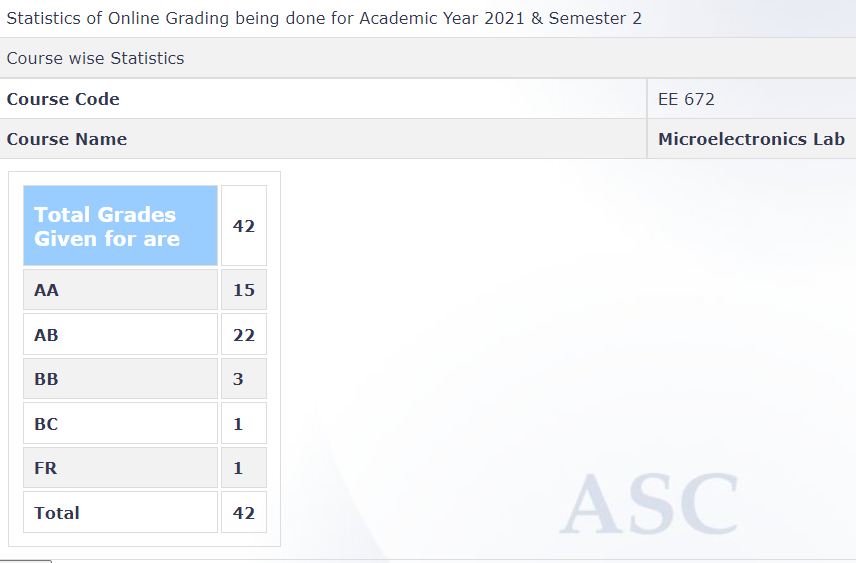

**Review by**
Adil Anwar Khan, 2023 (DD)

**Course Offered In**
Spring 2021-2022

**Instructors**
Prof. Swaroop Ganguly
Prof. Apurba Laha

**Prerequisites**
Knowledge of Device Physics (equivalent to EE 207 or EE 733)
Knowledge of Device Fabrication (equivalent to EE 669)

**Difficulty**
3/5 

**Course Content**
There were 10 experiments on the following topics –

Device Fabrication
    • Four-probe + RCA
    • Oxidation + Ellipsometry
    • Mask Design
    • Lithography
    • Metallization
    • RTP + Profilometry

Device Characterization
    • MOSCAP
    • MOSFET
    • PN Diode
    • Solar Cell

In a normal semester, the course would entail observing these experiments being performed in the nanofabrication lab by the TAs/ RAs and writing down the observations for a lab report. However, given the online nature of the semester, videos of similar lab demonstrations were uploaded before each class

 
**Feedback on Lectures**
As stated in the course plan, the N-th class comprised of -
    • Quiz (Part A) to test that you have watched the pre-posted N-th video
    • Q&A (doubt session) on pre-posted N-th video
    • Explanation of Report template for N-th video - will be due before (N+1)th class
    • Quiz (Part B) to test comprehension of (N-1)th video/ experiment

The quiz questions were released on SAFE app, however their answers were to be scanned separately and submitted on Moodle. The quizzes were around 30 minutes each and were easy in general barring one or two questions in each quiz. Midsem and Endsem exams were comprehensive covering multiple experiments and were comparatively more difficult.

Each lab report was due in a week after the corresponding lab and specific pointers and questions for each lab report were given. In terms of the content, some lab reports required numerical calculations on Excel/ MATLAB (for device characterisation) and were relatively lengthy and time consuming. Others were shorter with just a few descriptive answers required on the experimental procedure/ theory. There was also a short lab on mask design which required the use of a special mask layout software (CleWin 4).

**Feedback on Evaluations**
 Evaluation of quizzes and lab reports was slow and many of them were graded only towards the end of the semester. However, crib sessions were conducted for each of them.

**Study Material and References**
In general, the uploaded videos and PPTs were sufficient for completing the lab report and answering the quiz questions. However, for some lab reports, answers had to be searched from the given reference books and the internet.

The following two textbooks were recommended in the beginning of the course -
    • Silicon VLSI technology, fundamentals, practice, and modelling - James D. Plummer
    • Semiconductor material and device characterization - Dieter K. Schroder

**Follow-up Courses**
NA

**Final Takeaways**
For anyone interested in device physics and semiconductor fabrication, this lab course is a good option. However, if you are looking forward to hands-on work, it might not be the right choice given that most of the equipment is too sophisticated and expensive to be used in a lab course. All in all, it does provide a good insight into the basics of semiconductor fabrication and device characterization.

**Grading Statistics:**

