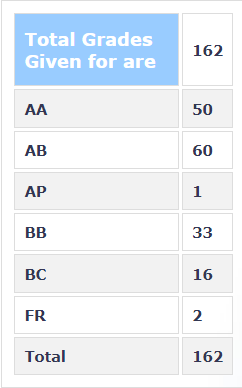

**Review by**

Dev Pratap Singh, 2024(Dual Degree)

**Course Offered In**

Autumn 2021

**Instructors**

Prof Virendra Singh

**Prerequisites**

EE224 Digital Systems

**Difficulty**

2 (1 being easy, 5 being difficult)

**Course Content**

-VLSI Design Flow
-High-Level Synthesis
-Logic Synthesis
-Logic Testing
-Multilevel logic optimization
-Heuristic optimization
-Physical Design

**Feedback on Lectures**

The lectures were conducted online on MS Teams. Recordings were also provided. In the beginning, the lectures were very repetitive and slow-paced. Class timings were usually followed and missed lectures were compensated (sometimes on weekends). Towards the end, lectures were sped through and topics were squeezed in. 

**Feedback on Evaluations**

This information is provided in the first lecture itself, but is not followed. We had weekly quizzes on the topics taught in previous lectures. The questions were not easy but solving 70-80% of them ensured that you earn decent credit. The midsem and endsem were conducted in 2 parts and both needed quick solving. There were some assignments during the semester and enough time was given for them. 

**Study Material and References**

-Synthesis and Optimization of Digital Circuits by Giovanni De Micheli
-Logic Synthesis and Verification by Hatchel & Somanzi
-Algorithm for Physical Design Automation by Naveed Shervani
-Current Literature (IEEE TC/TCAD/TVLSI)

**Follow-up Courses**

Any VLSI Design course.

**Final Takeaways**

The course is easy and requires an average amount of effort and time. Quite useful in terms of exploring the field of VLSI design. 

**Grading Statistics:**

