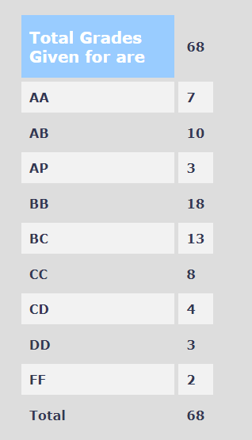

**Review by**

Saketika Chekuri, 2023(BTech.)

**Course Offered In**
Spring 2022

**Instructors**
Prof. Rajesh Zele

**Prerequisites**
A good understanding of EE204 since this course builds on the topics covered in that course. EE618 is stated as a soft pre-requisite, but it's not compulsory --- the professor's EE618 lectures are available on CDEEP, and he lists out which lectures to watch if he thinks a concept from that course is needed.

**Difficulty**
3.5/5
Not hard per se, but since each lecture builds on the previous, things can get challenging if you miss a couple of classes. The project also takes a significant amount of time.
Consistent efforts are needed.

**Course Content**
The course discusses the in-depth design of converters that convert analog data to digital and vice versa. It starts off with simplified block diagrams of Digital-to-Analog Converters (DACs) and Analog-to-Digital Converters (ADCs) and the definition of various parameters needed to characterize their performance.

Multiple types and architectures of ADCs and DACs are discussed for the rest of the course (exact topics can be found on the course webpage). The instructor builds up these circuits from known and simple blocks and slowly increases their complexity to the level discussed in research papers, highlighting the previous design's shortcomings overcome in each stage.

**Feedback on Lectures**

The lectures are lucid and highly engaging. The instructor often provided various analogies and insights to explain the designs, so attending all lectures and tutorials is highly recommended if you are taking this course. Detailed handwritten lecture notes are provided after every lecture.

**Feedback on Evaluations**
There is a short 5-minute quiz at the end of every lecture with two questions asked from that day's lecture, to take attendance and ensure students stay attentive in class.

The project has a high weightage, but it is divided into four parts with deadlines for each part a couple of weeks after the previous part's. This project is to be done on Cadence Virtuoso, of which there are only limited licenses. Only a limited number of people can use the software simultaneously, so working a day before the deadline is next to impossible.

The overall approximate weightage split is as follows:

1. Two quizzes - 10% each
2. Midsem - 20%
3. Endsem - 30%
4. In-class quizzes combined - 10%
5. Project - 20%
 
**Study Material and References**

Lecture notes are more than sufficient, but a few problems from Analog Integrated Circuit Design by Carusone have been provided for practice.

**Follow-up Courses**
None as of now -- there used to be a course on Delta Sigma Data Converters (EE699), but it is currently not being run.

**Final Takeaways**
This is the perfect follow-up course for anyone who is interested in Analog and wants to explore Mixed Signal design. It takes a decent amount of dedication to internalize the content covered, but is a must-do if you've enjoyed EE204 and/or EE618. 

**Grading Statistics:**

