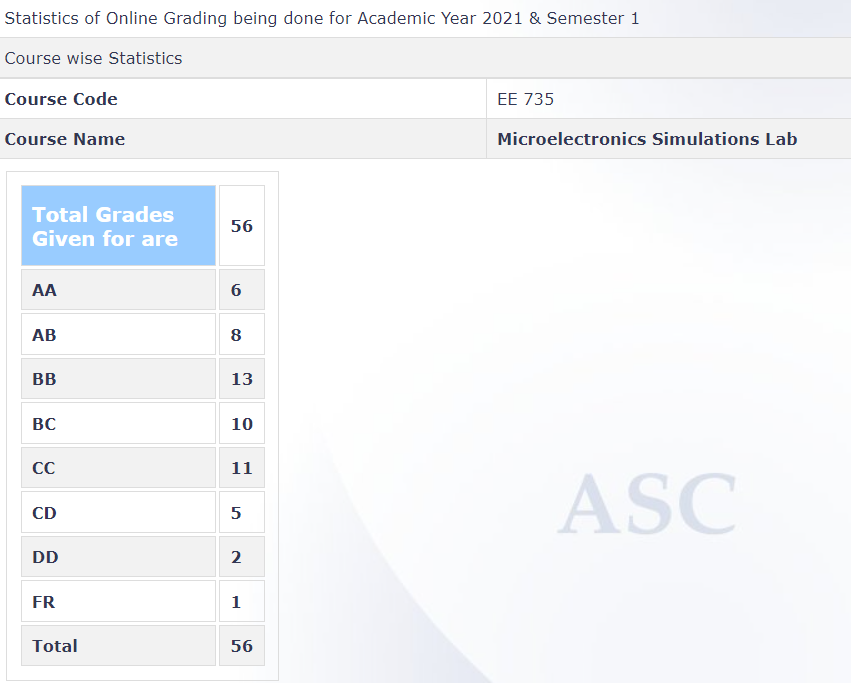

**Review by**
Archishman Saha, DD 2023 (Microelectronics)

**Course Offered In**
Autumn 2021-22

**Instructors**
Saurabh Lodha

**Prerequisites**
EE207: Electronic Devices and Circuits or EE733: Solid State Devices
EE669: VLSI Technology generally runs parallelly with this course, and can be considered as a soft pre-requisite as some concepts involved in this course would be supplemented from content covered there

**Difficulty**
Moderate to difficult

**Course Content**
The course mainly covered analyzing electronic devices at the microscopic level through simulating their properties, and obtaining characteristics. All concepts and realizations were better understood with the help of weekly simulation exercises involving constructing models of these devices. At the end of each week, a report comprising of the compiled results and inferences, had to be submitted along with working codes used for performing the simulations.
The first half of the course focused on running toy-models of devices using MATLAB. Post-midsem simulation exercises involved HSPICE and TCAD (Sentaurus and Silvaco) that are used to build and simulate devices taking into consideration real life properties and fabrication techniques used in industries.
The simulation exercises consisted of the following:
1. Simulating and analyzing the capacitance and electrostatic field for various configurations of parallel plates (MATLAB)
2. Obtaining charge profile, carrier concentration, Fermi energy and electric field variation for an abrupt and linearly graded pn junction diode using electrostatic equations (MATLAB)
3. Realizing carrier concentration profiles through simulating diffusion equations in accordance with ion-implantation process used to fabricate devices in labs (MATLAB)
4. Simulating electrostatics and characteristics of a pn junction diode developed using various growth and fabrication techniques (Sentaurus TCAD)
5. Incorporating ion-implantation technique to build devices and simulate properties
(Sentaurus TCAD)
6. Macroscopic modelling of devices and circuits using these devices (Verilog-A and HSPICE)
7. Simulate heterostructure, electrostatics, and characteristics of HEMT devices (Silvaco TCAD)
 
**Feedback on Lectures**
Weekly lectures were conducted during the lab slot wherein the theory and concepts involved
behind the respective lab exercise would be discussed. The TAs would also give an overview
of how to go about solving the latter. The lectures were indeed helpful as we would get
significant insights into the theory part.
In addition to these, there would be another type of weekly session wherein we could get
clarified our doubts with respect to the particular exercise assigned that week.

**Feedback on Evaluations**
In addition to weekly assignments, there had been a midsem and an endsem examination
which tested basic concepts and techniques used to perform the simulations. Some of these
questions would get a bit on the difficult end.
For the exercises, ample time would generally be given as sometimes they did get a bit time
consuming and computationally intensive.

**Study Material and References**
1. Semiconductor Device Fundamentals – Robert F. Pierret
2. Advances Semiconductor Fundamentals – Robert F. Pierret
3. Silicon VLSI Technology – James D. Plummer, Michael D. Deal, Peter B. Griffin
4. ATLAS TCAD manuals on Sentaurus and Silvaco

**Follow-up Courses**
Having done this course, one can take up EE672: Microelectronics Lab, that would go deeper
into the fabrication process of the devices modelled in this course using computational tools

**Final Takeaways**
This course gives oneself a feel of the concepts and equations encountered in the Electronic
Devices course, and so is greatly beneficial for those planning to pursue modelling devices at
either the macroscopic or microscopic level.

**Grading Statistics:**

