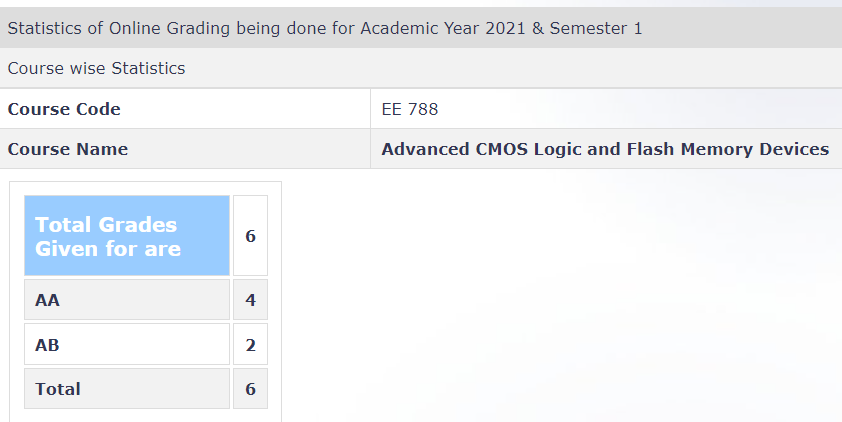

---
layout: page
title: EE 788 – Advanced CMOS Logic and Flash Memory Devices (2021)
cover-img: assets/img/Cover_study.jpg
thumbnail-img: ""
share-img: ""
comments: true
tags: [Elective, VLSI]
---

**Review by**
Anuranan Das, 2023(DD)

**Course Offered In**
2021 - Autumn

**Instructors**
Prof. Souvik Mahapatra

**Prerequisites**
EE207(Electronic Devices & Circuits) or EE733(Solid State Devices)
And EE620(Physics Of Transistors). 
Some familiarity with VLSI Technology(EE669) should be helpful, though not required.

**Difficulty**
3.5 out of 5. (Moderate)

**Course Content**
MOS Transistor Scaling (25%) → 

Non-classical scaling

Mobility boosters (Mechanical stress induced boost)

High-K Metal Gate (Gate First, Replacement Metal Gate)

Architectural changes (FDSOI, FinFET, GAA-SNS FET)

Variability, Self Heating

CMOS Logic reliability (45%) → 

Negative Bias Temperature Instability

Positive Bias Temperature Instability

Substrate and Gate current

Hot Carrier Degradation (HCD)

Stress Induced Leakage Current (SILC)

Time Dependent Dielectric Breakdown (TDDB)

Characterization methods

Variability and stochastic effects

Impact of Self Heating

Flash memory, scaling and reliability (30%) → 

Memory Operation - Charge Shifts

Basic FG cell structure, coupling

Array architecture (NOR and NAND Flash)

**Feedback on Lectures**
The lectures were very informative. The Professor used well-documented slides to supplement his lectures. Attending classes were important to understand as a lot of materials were covered in the classes. Professor was very enthusiastic in encouraging understanding from the students and stopped for questions after each slide. However, hindrances of online lectures were present.

**Feedback on Evaluations**
The evaluation followed the following criterion →

Assignments (50 %) – Involved basic TCAD simulations and MATLAB/Python scientific simulation. Trend-fitting was one of the most common exercises. The assignments were quite involved intuitively and there could be more than one approach to solve them.

Literature review, seminar (20 %) - Individual topics were assigned to every student. At the end of term, there was a seminar on the individual topics.

Mini Project (30 %) – Involved TCAD simulations and MATLAB/PYTHON simulation for Double barrier gate leakage characteristics. One was expected to do optimization and use scattering formalism to match results with those of a paper and distinguish between classical and semi-classical domains.

There were no formal quizzes and examinations.

**Study Material and References **
The slides and lectures were good enough. There were additional guest lectures from speakers from INTEL and Micron on cutting edge flash memory technologies(3D). 

For doing assignments and mini-projects , one may need to do a proper literature survey regarding the topic at hand. Some of the references were provided by the professor, other literature resources(use google scholar or similar metasearch sites) may be needed for better tweaking the programming models.

**Follow-up Courses**
This is an advanced course. One gets to learn the problems ailing devices industry and the overview of latest technology trends. One could take up a project on devices confidently as an extension of the concepts taught in this course.

**Final Takeaways**
If you are interested in electronic hardware, especially the device fabrication and characterization aspects of it, this is a go-to course. The assignments acts as a great exercise for scientific simulations and helps one in understanding the depth of VLSI better alongside practical uses of optimization tools in this field. 

**Grading Statistics:**
