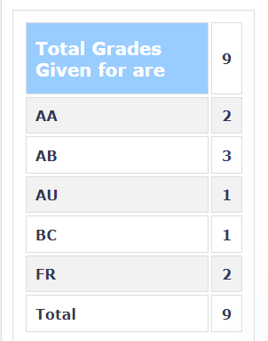

**Review by**
Suraj Samaga, 2023(B.Tech)

**Course Offered In**
Autumn 2022

**Instructors**
Prof. Souvik Mahapatra and Prof. Sandeep Mondal

**Prerequisites**
EE 207 (Electronic Devices & Circuits) OR EE733(Solid State Devices) AND EE 620 (Physics Of Transistors). 

EE 620 was later dropped as a prerequisite, and important parts from that course were discussed briefly in the beginning.

**Difficulty**

5/5

**Course Content**
- MOS Transistor Scaling (30%) 
    - Non-classical scaling
    - Mobility boosters (Mechanical stress induced boost)
    - High-K Metal Gate (Gate First, Replacement Metal Gate)
    - Architectural changes (FDSOI, FinFET, GAA-SNS FET)
    - Variability, Self Heating
- CMOS Logic reliability (40%)
    - Bias Temperature Instability (BTI)
    - Hot Carrier Degradation (HCD)
    - Time Dependent Dielectric Breakdown (TDDB)
    - Variability and Self Heating impact on reliability
- Flash memory, scaling and reliability (30%)
    - NOR Flash (Floating Gate, Mirror Bit)
    - NAND Flash (Floating Gate, 2D)
    - NAND Flash (3D NAND) 

**Feedback on Lectures**

Each lecture was very content heavy with quite a few concepts being discussed. However, the slides were well presented, and Prof. Mahapatra adequately explained each topic. The professor stopped at regular intervals to entertain questions, and since the class strength was relatively small, the professor encouraged open dialogue. It is advisable to attend all classes, as the concepts build up one after the other. There was also a guest lecture towards the end on DRAM. Prof. Mondal held extra classes to cover content relating to EE 620.

**Feedback on Evaluations**

- One set of assignments dealt with MOSFET current simulations on MATLAB using different current models, with/without mobility variations
- The next set of assignments dealt with transistor reliability and mostly involved fitting empirical models on data on MATLAB
- The last set of assignments were on transistor fabrication on TCAD and involved fabricating an NMOS and simulating for short channel effects

There were 2 vivas conducted, one to discuss the assignment contents and another to test the concepts taught. These vivas turned out to be the deciding factor in terms of grading.

**Study Material and References**

Slides were sufficient. Relevant research papers were added as and when any new topic was discussed. Help sessions were conducted to introduce the class to TCAD.

**Follow-up Courses**

**Final Takeaways**

This is an advanced devices course and mainly discusses reliability issues concerning MOSFETS. Memory devices are treated as a separate topic. This is a specialized but intriguing course to take, nonetheless, if one is even vaguely interested in devices. 

**Grading Statistics:**
