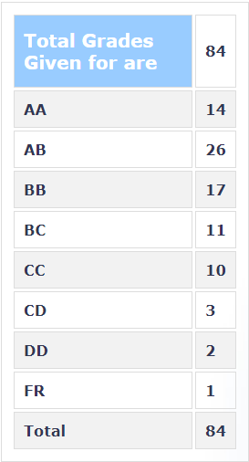

**Review by**

Parvik Dave, 2023 (BTech.)

**Course Offered In**

Autumn 2022

**Instructors**

Prof Madhav Desai

**Prerequisites**

The course has no hard prerequisites as such. Still, having done fundamental courses on digital design and having a good knowledge of VHDL helps. 

**Difficulty**

3/5

**Course Content**

As the name suggests, this course describes a basic, algorithmic manner in which digital systems are designed. Control path and data path concepts are discussed. The course begins with a recap of FSMs and then introduces the notion of Petri nets, which are later analyzed to show how they model algorithms. The course then introduces the AHIR v2 package, which comprises the Algorithmic Assembly (Aa) language developed by the professor himself. This is then used to desgin blocks such as pipes, storage,  and analyze dependencies in hardware design, and latency. Some concepts from queuing theory, OS, were also borrowed at times. Nonetheless, it was easy to follow these without knowing them beforehand.

**Feedback on Lectures**

The lectures were medium-paced and easy to follow. They did get a bit monotonous and digressed from the topic at times. Still, overall, they were engaging. Taking notes is recommended because the prof used the board extensively to deliver content that wasn't in the slides. Attending classes is important because missing a couple of classes makes it challenging to keep up with what is happening.

**Feedback on Evaluations**

The evaluations were mainly conceptual and related to the content discussed in class. Exams and quizzes were open notes. The course had 3 assignments, a midsem, an endsem (which was take-home), and a quiz. The weightage was not disclosed. 

**Study Material and References**

No reference books were mentioned for the course. The course's content mainly implements many of the concepts already learned in digital design and algorithms. 

**Follow-up Courses**

--

**Final Takeaways**

EE789 is an excellent course for someone interested in digital design because this provides a new paradigm of thinking instead of traditional methods using FSMs, similar to what happens in the industry.

**Grading Statistics:**

The grading was fair with a decent number of AAs and ABs awarded. Attending classes regularly and keeping up with the course and assignments is almost definitely going to land you a good grade. 

