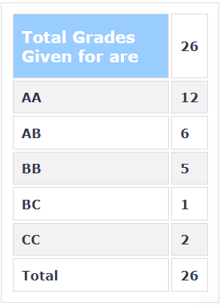

**Review by**

Prakhar Diwan, 2023 (DD)

**Course Offered In**

Spring 2021

**Instructors**

Prof Shalabh Gupta

**Prerequisites**

UG level courses on analog & digital electronics and signal processing

**Difficulty**

5/5 

**Course Content**
*Main Topics*
1. Clocking in serial links: Asynchronous vs. Synchronous; Plesiochronous vs. Mesochronous systems; overview of high-speed serializers and deserializers.
2. Eye diagrams and BER estimation
3. Phase-locked loops (PLLs) and delay locked loops (DLLs): Building blocks; Loop analysis; non-idealities in the PLLs/DLLs; Jitter and phase noise; Jitter transfer functions in DLLs and PLLs; BER estimation based on jitter
4. Transmission lines (T-lines): Lossless/lossy T-lines; S-parameters, impedance matching; Pulse propagation in T-lines; Coupled/differential T-lines.
5. Clock and data recovery (CDR): Phase detectors; Basic circuit level blocks Latches, flip-flops, XOR gates, muxes etc. in Current Mode Logic (CML); Circuit level bandwidth enhancement techniques; Tunable delays using tunable delay cells and phase interpolators; Voltage controlled oscillators (VCOs); Multi-phase clock generation; CDR architectures
6. Equalization and equalizers: Channel model and inter-symbol-interference (ISI); Pre-cursor and post-cursor ISI; Analog and Digital domain equalizers (CTLE, FFE etc.); Equalizer training and blind equalization techniques; Eye monitor circuits for equalizers.
7. Transmitters and serializers: Block diagram of a serializer; LVDS and impedance matching; Pre-emphasis (FIR) equalization for transmitters.

*Other topics* 
1. Achieving higher-speeds using m-PAM signaling
2. Line coding with examples (such as 8b-10b, 64b-66b) 
3. Multi-lane serial links and current trends
4. Introduction to high-speed optical interconnects: Building blocks & Signaling techniques

**Feedback on Lectures**

The focus is on system/architectural level design/understanding, some circuits were also discussed. The lectures were well-conducted, professor answered and encouraged student's queries. Most of the listed content was covered. Prof covered the theoretical concepts and then assignments were given to implement and learn using ANSYS/Cadence tools. Tutorials and doubts related to assignments/project were conducted at end of lectures too if required. 

Most of the course contents are heavily used in practice. References are recommended for some portions of the course and were pointed to by the instructor. 

Attending lectures is fruitful if you are interested in analog electronics, system level design etc. as you get exposed to various ideas; and it helps in regular evaluations. We had a talk from Meta researcher at the end of course, as an industry case study. The course is practical in nature and highly relevant for VLSI industry.  

**Feedback on Evaluations**

Evaluation consisted of: 
1. Short quizzes (objective type) at the end of classes (weekly) [25%]
2. 3 Assignments (individual) and 1 Project (grp of 2) [35%] 
3. Mid-sem exam [15%]
4. End-sem exam [25%]

There was some incentive provided for attending lectures and taking notes. Hand-written notes were allowed for all the evaluations. Assignments and projects were carried out using ANSYS Electronic Desktop and MATLAB. These were hectic and required a lot of time and efforts, though helped a lot in learning. 

Short quizzes were simple and based on immediate week's syllabus. Midsem and endsem did have challenging questions.  
 
**Study Material and References**

1. Advanced Signal Integrity for High-Speed Digital Designs, S. H. Hall and H.L. Heck, John Wiley & Sons, 2009
2. Digital Systems Engineering, W. Dally and J. Poulton, Cambridge University Press, 1998 
3. Design of Integrated Circuit for Optical Communications, Behzad Razavi, McGraw-Hill, 2003 
4. Fiber-Optic Communication Systems (Fourth Edition), Govind P. Agrawal, John Wiley & Sons, 2011.

**Follow-up Courses**

N/A

**Final Takeaways**

This course gives you insight into latest developments in interconnects domain. It covers a broad spectrum of related topics as well to give an overall view. The course requires persistence and significant time commitments. Learning is heavily dependent on your will.

If you want a chill course then this one ain't for you. This course can be tagged as specialization elective for microelectronics students. 

**Grading Statistics:**

