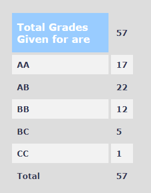

**Review by**

Rohan Rajesh Kalbag, 2024 (BTech.)

**Course Offered In**

Autumn 2022

**Instructors**

Prof. Virendra Singh

**Prerequisites**

Digital Systems (EE 224)

**Difficulty**

2/5

**Course Content**

The course involves the various algorithms involved in VLSI design automation (CAD) softwares. This a nice course if one is interested in algorithms

Important Subtopics include - High Level Synthesis, Logic Synthesis, Placement, Routing, Partitioning

A more detailed progression of the course contents - The course started with general VLSI design process, Gajski's y chart, historic attempts at automation, different ways representation of logic functions, Boolean Algebra, BDDs, SAT problems, DPLL algorithm, SAT solvers and reduction algorithms(redundant for those who have done EE 224, it was done primarily for PGs), representations of circuits as graphs, architectural synthesis, scheduling algorithms like ASAP, ALAP, scheduling problem representation as integer linear programming problems, resource binding, compatability and conflict graphs, register binding, left edge binding, Test generation algorithms, Testability of combinational and sequential circuits, time frame expansion, D algorithm, PODEM, minimizing sequential depth. Logic Synthesis algorithms like KMAP, Quine Mccluskey, Patrick' method. Positional representation of logic functions and its use for heuristic logic optimization automation like expansion etc. Finite State Machines, algorithms to check equivalence of states, product machine, model checkers for FSMs (a brief introduction to Computational Tree Logic was also done by the instructor for this), scan chain, graph partitioning like KL, clustering, FM algorithms, placement, floor planning, routing algorithms like Lee's algorithm.

The instructor had initially planned on covering Multilevel Logic Minimization but wasn't able to cover due to time constraints.

**Feedback on Lectures**

The teaching was excellent and the course content was interesting. Lectures were taught on black board. Students were encouraged to ask doubts in the class. Attending lectures and making notes is a must to get a good grade in this course. There was an interesting guest lecture on the topic of Fault Simulation by the visiting professor Prof. Janak Patel on which a graded surprize quiz too was taken!

Apart from the regular course content, the instructor had occassional digressions to interesting research fields in VLSI such as Patchable Hardware, Approximate Circuits, Quantum and Reversible Circuits

**Feedback on Evaluations**

Initially the weightages informed by the professor were as follows

- Mid Term Exam (15%)
- Final Exam (30%)
- Assignments (20%) set of assignments (mostly programming based)
- Course Projects (15%) : Projects to implement CAD algorithm
- Continuous Evaluation Quizzes (20%) : Weekly tests (Tuesday)
- Presentation/Viva (5%) (BONUS)
- Research Project (15%) (BONUS)
- Class notes (3%) (BONUS)

The final exact weightages for the evaluation wasn't announced by the instuctor. Weekly/Fortnightly (some times) quizzes were held every Tuesday, applications of the topics covered in the previous week were generally asked in these weekly quizzes and attending lectures should be sufficient to answer them correctly. There was a finite time midsem and an infinite time endsemester examination (of two parts) for this course (students on average took 8-9hrs to finish), which was open notes and open books and which tested the student's ability to apply the various algorithms learnt to solve open ended design problems, there were a few straight forward questions as well. There was an assignment to design a logic simulator and also a course project (solo/groups of 2-3) where few algorithms covered in the course had to be implemented in code and their performance had to be analyzed (preferably in C, C++, Python) which was a very interesting experience. The project and assignment problem statements weren't formally released on Moodle but told in the lectures. They took a considerable fraction of the winter as the projects and assignment submission links were released a couple of days before the grade submission deadline. The professor himself took the viva of the course projects.

**Study Material and References**

Referring these books/resources is highly recommended to get a better idea of the contents covered in the lectures

1. Synthesis and Optimization of Digital Circuits : Giovanni De Micheli
2. Logic Synthesis and Verification : Hatchel and Somanzi
3. Algorithm for Physical Design Automation : Naveed Sherwani
4. Slides of Prof. Virendra Singh's previous offering of this course
5. http://users.ece.northwestern.edu/~haizhou/357/

**Follow-up Courses**

 CS 654 - Current Topics in VLSI and System Design

**Final Takeaways**

This is an extremely interesting and recommended course for those interested in algorithms and digital systems. It shows how any circuit design/optimization/testing problem can be converted to an equivalent graph/ILP problem which can be solved using various algorithms. This course introduces one to the various methods used in circuit design automation in modern VLSI industry.

**Grading Statistics:**

