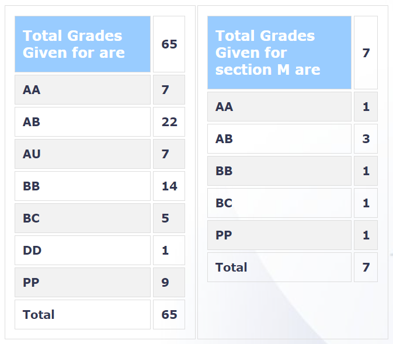

**

---

layout: page

title: Course Reviews

subtitle:

cover-img: assets/img/Cover_study.jpg

thumbnail-img: ""

share-img: ""

comments: true

tags: [Academic]

---

  
  

### CS 754 – ADVANCED IMAGE PROCESSING

  
  

**Course offered in:**

  
  

Spring 2019

  
  

**Instructor:**

  
  

Prof. Ajit Rajwade

  
  

**Course Content:**

  
  

1) Image compression through DCT.  
2) Compressed sensing, theory (convergence bounds) and algorithms like OMP, MP, LASSO, ISTA.  
3) Rice single pixel camera, Increasing frame rate without much loss of quality  
4) Tomography  
5) Dictionary learning through SVD, PCA, NMF, NNSC  
6) Overcomplete dictionaries. KSVD  
7) Blind Compressed sensing  
8) Classification problems

  
  

**Prerequisites:**

  
  

CS 663 or EE 610 or CS 725

  
  

**Feedback on Lectures:**

  
  
Lectures are well paced. Instructor uses both board and slides to explain the concepts. He highly encourages doubts and 5% marks were kept for class participation to encourage students to ask more doubts. The instructor also kept office hours before the class where he used to clear doubts of students.
  
  

**Feedback on Tutorials, Assignments and Exams:**

  
  

The instructor used to keep tutorials (mostly included doubt solving) on weekends to solve common doubts and some questions.  
There were 6-7 assignments decided (but due to COVID only 3 were graded). They were put every 2 weeks and were interesting as well as highly demanding. Assignments had 50% weightage.  
Midsems and endsems were 10% each.  
Course project had 25% weightage and was the major factor in deciding the grades. The project included reviewing a related paper.  
Finally, 5% was kept for class participation.  
The instructor also expects compulsory attendance.

**Grading Statistics:**

  
  

  
  
  

**Difficulty:**

  
  

(on a scale of 1 being very easy to 5 being very hard): 3

  

**Study Material and References:**

  
  
Lecture slides were sufficient.

  

**Takeaways from the course:**

  
  

The course majorly deals with Compressed sensing and sparse signal processing which is a highly valued field in signal processing. Compressed sensing techniques are widely used in tomography, MRI and video and image compression. Sparse signal processing provides a good alternative to ML based techniques majorly when dataset is scarce.

Reviewed by - Ameya Anjarlekar (ameyanjarlekar@gmail.com)

**