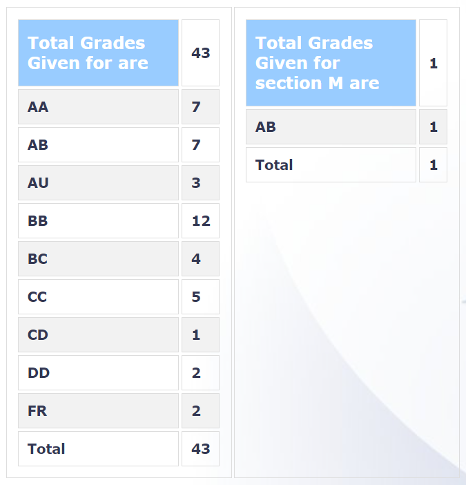

  
  

###  CS 754 – ADVANCED IMAGE PROCESSING

  
  

**Course offered in:**

  
  

Spring 2018

  
  

**Instructor:**

  
  

Prof. Ajit Rajwade

  
  

**Course Content:**

  
  

This year was the second offering of the course and the professor might change the topics slightly depending on the reviews. The detailed course contents are available on course website. (The link is at the end of review). Broadly, the topics covered this year were the following (in the same order):

-   Compressive Sensing
-   Tomographic Reconstruction
-   Dictionary Learning
-   Statistics of natural images
-   Reflection removal, low rank matrix recovery etc

The focus is slightly more towards image processing with a perspective on signals as compared to learning based approaches.

  
  

**Prerequisites:**

  
  

A basic probability and statistics course (equivalent to CS 215 or EE 223) and preferably DIP (CS 663/ EE610), or CS 725 (Machine Learning) is strongly recommended by the professor

  
  

**Feedback on Lectures:**

  
  
The lectures are excellent and very easy to follow. The Professor teaches the topics very well and ensures that you understand each topic along with its nuances in the class. He encourages doubts and discussions in the class which are very helpful. The slides are comprehensive but it is necessary to pay attention in the class. This year the lectures were recorded for CDEEP too.
  
  

**Feedback on Tutorials, Assignments and Exams:**

  
  

This course unlike most other courses is focussed towards assignments and the project. The midsem and endsem both are of 10% weightage, and are fairly straightforward. Being attentive in the class discussions, and going through the slides properly is sufficient to do well in the midsem and endsem. A major chunk of the weightage (55%) goes to assignments. There were 5 assignments in teams of 2, and it takes considerable amount of time and effort to solve them. Reading new research papers and working out different (but related) theory and proofs was the theme of most assignments. They were a mix of coding and theoretical questions. The questions in the assignment are well chosen and provide a good insight into the covered content.  The project is of 25% credit and is highly stressed by the professor. This is a research centric coure and hence the project is a very important part of it. The professor strongly recommends and motivates a well-thought out project and promotes and rewards ingenious ideas and implementations. If you are working with the professor for an RnD project that semester, he also allows you combine your RnD work with the course project.

**Grading Statistics:**

  
  

  
  
  

**Difficulty:**

  
  

The professor ensures that the course in enjoyed by everyone, and that everyone in the class is on the same page always. The course is mainly about the assignments and the project, which take some dedicated amount of time. The assignments are well spaced out, so it is not very intensive as such. This course is highly recommended for anyone who is enthusiastic to take up a higher level course in Image processing but on a broad scale without going into the specifics of any substream.

  

**Study Material and References:**

  
  

The slides are comprehensive and self sufficient. The instructor also posts some additional reading material and references on moodle. For more details about specific modules of the course, refer [this](https://www.cse.iitb.ac.in/~ajitvr/CS754_Spring2018/) link.

**
