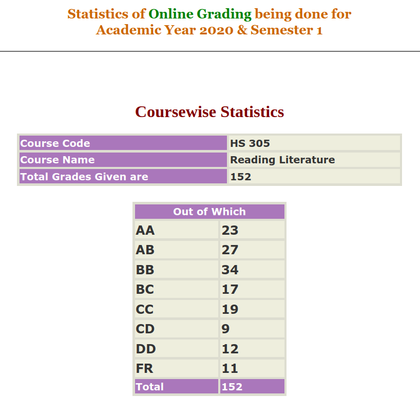

---

layout: page

title: Course Reviews

subtitle:

cover-img: assets/img/Cover_study.jpg

thumbnail-img: ""

share-img: ""

comments: true

tags: [Academic]

---
### HS 305 – Reading Literature

**Course offered in:**

Autumn 2020

**Instructors:**

Prof. Sharmila  
Prof. Sharmishtha Saha  
Prof. Suddhasheel Sen

**Course Content:**

The course was divided into three segments-

Segment A : Prof. Sharmila ( Uses of literature, close reading, structure/setting of text)  
Primary readings :  
Arthur Conan Doyle, “The Red-Headed League”, Detective Story  
Susan Sontag, “AIDS and its Metaphors”, Prose Non-Fiction (extracts)  
Baby Kamble, “The Prisons We Broke”, Autobiography (extracts)  
Dino Buzzati, “The Epidemic”, Short fiction, Political Satire

Segment B : Prof. Sharmishtha Saha (Genre-specific study of literature, comedy as a genre, comedy in different cultures/contexts)  
Primary readings:  
Alfred Jarry, “Ubu Roi”  
Habib Tanvir, “Charandas Chor”  
Henri Bergson, “Laughter”  
Secondary readings:  
David Dean Shulman, “The King and the Clown”  
Lee Siegel, “Laughing Matters”  
Mathew R. Meier, Casey R. Schmitt, “Standing up, Speaking out”
Segment C : Prof. Suddhasheel Sen (Usage of literature to express views, adaptation of texts to address social issues, study of adaptations wrt target audiences)  
Primary readings/viewings:  
Munshi Premchand, “Sadgati” (Story)  
Satyajit Ray, “Sadgati” (Film adaptation of the story)  
Henrik Ibsen, “An Enemy of the People” (Play)  
Satyajit Ray, “Ganashatru” (Film adaptation of the play)  
  
(Everything was covered)

**Prerequisites**:

Nothing as such. It is a Humanities Elective, so it is best for everyone to take it when it is suggested in their curriculum (to avoid slot clashes)

**Feedback on Lectures**:

Prof. Sharmila (Segment A): The professor expected each class to be as interactive as possible. Readings were assigned regularly, but as the primary readings were mostly short stories/specific chapters from books, the workload was not very heavy. The instructor encouraged us to re-read certain passages, and focused more on close reading. Lectures often included slides which were brief, each point being expanded by the professor.  
  
Prof. Sharmishtha Saha (Segment B): Readings of the plays ‘Ubu Roi’ and ‘Charandas Chor’ were done in class. The plays were somewhat challenging, so efforts were needed on the student’s end to complete readings of the plays as the discussion progresses in class. In addition to these, the secondary readings were to be read in order to understand the finer points of the plays as well as the discussions. The professor laid emphasis on the students understanding and interpreting concepts of humor, comedy, evolution of a genre and relating them to the primary reading as well as contemporary works of comedy (group assignment).  
  
Prof. Suddhasheel Sen (Segment C): While the short story ‘Sadgati’ is, in fact, short, the play ‘An Enemy of the People’ is considerably long and has five Acts. The lectures were mostly based on readings assigned in the previous class. The main focus of this segment was to compare adaptations with the original works of literature. The assignments were also directed towards this objective. Discussions and debates were encouraged by the professor, and the class was mostly informal.

**Feedback on Tutorials, Assignments and Exams**:

Prof. Sharmila (Segment A):  
There were 4 assignments with different word limits and weights. Each assignment was based on a specific problem statement. The grading was more than fair, and the professor often gave generous feedback to the submission.  
  
Prof. Sharmishtha Saha (Segment B):  
There were 3 written assignments of equal weight and a group presentation. The written assignments were graded fairly, with marks lost for grammatical errors. The group presentation was to be made on any work of comedy which we found interesting, and the same sort of analysis that was discussed in class was expected to be applied to it. Groups of 3-4 students were expected, and a video of about 20 mins was to be submitted. There was a group viva on the basis of this submission, which mainly focused on whether we understood what we presented.  
  
Prof. Suddhasheel Sen (Segment C):  
There were 2 assignments without a word limit, which were based on ‘Sadgati’ and ‘An Enemy of the People’ respectively. The grading was fairly lenient, with short comments and feedback on the submission.

**Difficulty**:

3/5

**Grading Statistics:**

**Study Material and References:**

Everything to be read was provided by the professors at the beginning of each section. The slides were also provided, but since the discussions often went quite deep into the subject matter, the slides did not help much. Making short notes during the discussions might help in framing your responses in the assignments. Also, keeping up with the reading is a must, and the deadlines set by the professors are quite reasonable.

**Comments**:

This course was not rigorous at all. There were no midsems/endsems. The instructors were quite reasonable about deadline extensions (if a significant portion of the class had issues). Plagiarized submissions were graded poorly. In short, if you enjoy reading, and would be willing to put in 2-3 hours per week for the same, this course would be a good option for you.

**Advanced courses that can be taken after this**:

HS431 – Reading Fiction

**Takeaways from the course:**

Will help in improving your reading habits and exposing you to some great works of literature ![🙂]

Review by – Pranav Page (pranavpage33@gmail.com)