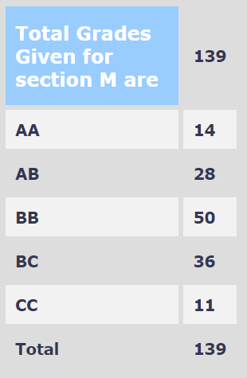

**Review by**

Prateek Garg, 2025(Dual Degree)

**Course Offered In**

Autumn 2021

**Instructors**

Prof. Krishna S

**Prerequisites**

N/A

**Difficulty**

3/5

**Course Content**

- Propositional Logic
  - Natural Deduction
  - Proof rules and Semantics
  - Soundness and Completeness
  - Normal forms
  - Horn clauses and Horn Algorithm
  - Resolution
- First order logic
  - First Order Structures
  - Deterministic Finite Automata
  - Non-Determinism  
- Second order logic
- Transition Systems and Temporal Logic
  - Linear time Properties
  - Infinite Words and Buchi Automata
  - LTL Model Checking

**Feedback on Lectures**

The lectures were excellent and online, so we were supposed to watch lectures before coming to class. The lectures were a recap of videos. The slides were excellent too, but to absorb the material, videos were essential. The explanations were quite lucid and easy to follow, and the material covered was also quite interesting. Although, the last few weeks were rushed.

**Feedback on Evaluations**

1. 10% Weekly Moodle Quizzes(best 4/7)
2. 20% Assignments(4)
3. 20% Quizzes(2)
4. 20% Midsem
5. 30% Endsem

Exams were easy if you covered the material well. The assignments were quite helpful in understanding the course material. There was an optional reading project for interested people.

**Study Material and References**

- Huth and Ryan : Logic for CS

**Final Takeaways**

This introductory course is helpful for those who want to explore theoretical computer science.  

**Grading Statistics:**

