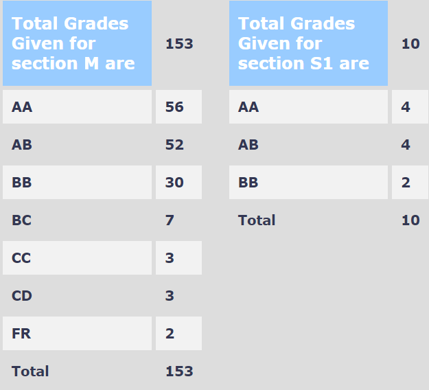

**Your Name and Batch**:

Pranava Singhal, 2024(B Tech)

**Course Offered In**:

Autumn 2020-21

**Instructors**:

Prof. Manjesh Hanawal, Prof. Amit Sethi, Prof. Sunita Sarawgi, Prof. S. Sudarshan
    
**Prerequisites**:

 None

**Difficulty**: 

The course is a beginner level course for data science. The challenging aspect of the course is the programming assignments. If you are well versed with python it should be a breeze, if not, it will defintely strengthen your programming skills.

**Course Content**: 

The course starts with a basic introduction to probability and statistics - basic distributions, random variables, maximum likelihood and maximum aposteriori estimation. Then there is a rigorous introduction to linear regression covering the mathematics in good detail, including different regularisers like L1, L2 and Huber loss. This is followed by an indepth coverage of data visualisation techniques. Then there is a very brief coverage of fundamental machine learning models like decision trees, support vector machines and neural networks. Do not expect to get a very rigorous mathematical coverage of these models, only a basic intuition. The last few lectures cover basics of deep learning and focus on its practice and tools commonly used. There is a lecture on SQL and important ideas like map-reduce.

**Feedback on Lectures**:

Lectures did not go into great mathematical detail but did a good job of giving a basic introduction and intuition of most machine learning models. After taking this course you will be comfortable using popular machine learning libraries like scikit-learn and numpy, as well as data visualisation tools like matplotlib and seaborn. You will be in a good position to understand more advanced machine learning texts using the fundamentals learnt in this course.

**Feedback on Evaluations**: 

A large part of the course evaluation was programming assignments which needed a good amount of time, especially if you are new to python. These were graded fairly. A fairly easy objective-question based midsem was also conducted. Another major chunk was the end-term project which was done in groups of two or three. The aim was to take up a data analysis or machine learning problem and cover it thoroughly.

**Study Material and References**:

Pattern Recognition and Machine Learning (Christopher M. Bishop) is a more advanced reference, to do well in the course the slides should be enough

**Grading statistics**: 

**Follow-up Courses**: 

DS303/CS419 and CS726 followed by more specific ML courses based on which direction interests you