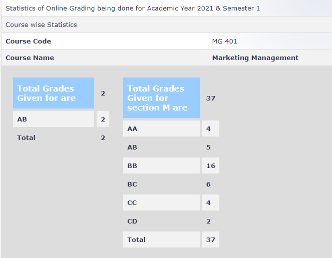

**Review by**

Krishna Soni (190070032)

**Course Offered In**

Autumn 2021

**Instructors**

Prof. Arti Kalro (1st half) and Prof. Dinesh Sharma (2nd Half)

**Course Content**

First half: Marketing Strategy (5Cs) and Marketing Mix (4Ps), Growth Opportunity and
Strategic Market Planning, Marketing Research, Segmentation-Targeting-Positioning (STP),
Product Life Cycle (PLC), Product Mix, Branding, Consumer Behaviour, & Integrated
Marketing Communications (IMC)

Second Half- Customer Profitability Analysis and Customer Lifetime Value, Pricing,
Place and Distribution, Services Marketing, Competition Strategies, digital marketing
 
**Feedback on Lectures**

The first half of this course is well planned out and an amazing experience. Prof Arti’s class is
filled with discussions, practical examples, and interactions, making the course really fun. I
completed this in my online semester, and it was by far one of the most exciting courses.
We had live lectures during the class timings. And believe me, I didn’t even watch the
recordings of my other core courses but I attended every lecture of this course live.

The Second half of the course is taken by Prof. Dinesh Sharma and is filled with tons of elaborate
case studies. For every concept, a case study is discussed thoroughly after the theory.
Students are expected to try them our before coming to the class.

**Feedback on Evaluations**

First Half - The
evaluation comprises of in-class surprise assignments (involves solving case studies in
groups), quizzes (mix of theory, case studies) and a course group project wherein you
analyse the marketing strategies of actual MNC’s and make a presentation of the same.

Second Half - The evaluation is
comprised of case study based assignments, presenting articles (one allotted to each grp) in
class, endsem (numericals and theory) and a group course project wherein we were allotted
an OTT platform each and had to devise their pricing/marketing strategies and present it.

**Final Takeaways**

This course is full of hands-on experience, practical examples, case studies and interaction. I
took up this course in my 5th semester as I wanted to attend it offline (eventually didn’t
happen) but would strongly recommend students to take this up as their 1st minor course
as this would really get them motivated towards the minor.

**Grading Statistics:**
