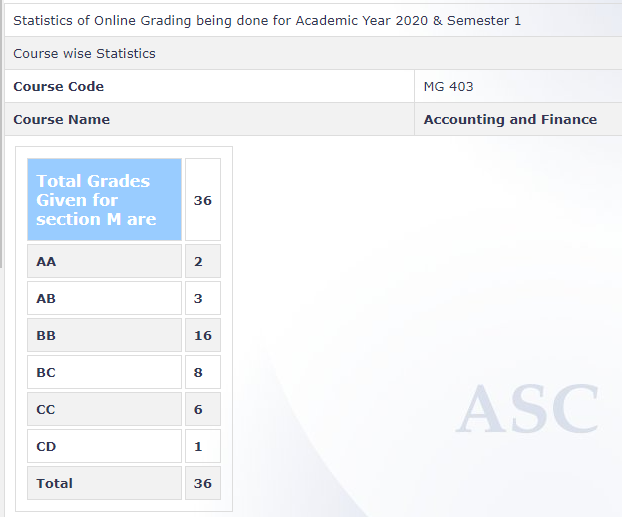

**Review by**

Krishna Soni (190070032)

**Course Offered In**

Autumn 2020

**Instructors**

Prof. Varadraj Bapat (First Half), Prof. Rohan Chinchwadkar (Second Half)

**Course Content**

First Half: Principles of Accounting (Assets, Liabilities, Depreciation), Basics of Financial
Statements (Balance sheet, P&L, Cash Flow), Interpretation and Analysis of these
statements (Ratios analysis, vertical analysis, horizontal analysis)

Second Half: Introduction to Corporate Finance & Financial Systems, Risk & Return Models,
Hurdle Rates, Measuring Investment Returns, discounted cash flows, Net present value of
money, Capital Structure, Introduction to Valuation, Dividend Decisions
 
**Feedback on Lectures**

The first half- This is taken by Prof. Bapat and focusses on Basics of Accounting. The prof.
gave us his own NPTEL lectures on this course (available on YT) to watch and then discussed
the concepts in the class. The course has a lot of hands on as the professor discusses many
balance sheets and other financial statements. Even the exams are mostly about
interpreting and solving these statements and don’t involve any mugging but pure concepts.
The professor is great at teaching and starts from the basics but also conducts surprise
quizzes (yeah, no announcements, complete surprise). Apart from surprise quizzes, midsem,
there was also a project where everyone was allotted a different company (For eg. I was
allotted Dabur) and were expected to solve an assignment by studying their annual reports
and financial statements.

The second half- This is taken by Prof. Chinchwadkar and focusses on Finance. This part is
very structured. All quizzes and deadlines are announced well in advance. Even the plan for
each lecture is told in the first lecture. The prof. is considerate and good at explaining stuff.
Evaluation included quizzes, endsem and a project. Again, the exams were mostly focused
on numericals but also included theoretical questions this time. For the project, we were
again allotted a company and asked to answer a set of questions by studying their annual
report.

**Feedback on Evaluations**

Thus, the overall course evaluation is very application based and doesn’t involve mugging. 

**Final Takeaways**

This course gives us an insight into accounting and finance which is essential for
everyone, be it any profession.

**Grading Statistics:**
