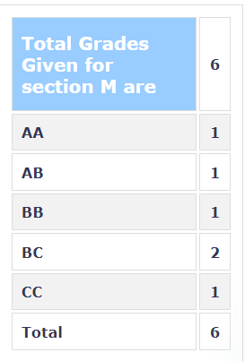

### PH251 – Classical Mechanics

**Your Name and Batch:** 

Prakhar Bansal(2024, B.Tech)

**Course Offered In:**

 Autumn 2021

**Instructor:** 

Prof Sai Vinjanampathy

**Prerequisites:** 

None

**Difficulty:**

 Easy

**Course Content:**

Hamilton’s principle, variational method and Lagrange’s equations with and without constraints. Centralforce, Kepler’s laws. Hamilton’s equations, canonical transformation,Poisson brackets. Periodic motion, small oscillations, normal coordinates.Rigid body dynamics.

**Feedback on Lectures:**

Lecture content was easy to grasp. Professor Sai tends to have a lot of discussions in class which helps in understanding the material thoroughly. 

**Feedback on Evaluations:** 

2quizzes (10% each) + Midsem (30%) + Endsem (50%) Exam problems were very easy and solely based on class illustrations and tutorial problems

**Study Material and References:** 

(i)Goldstein, Classical Mechanics (Theory), (ii) Landau and Lifshitz(Advanced Problems)

**Grading Statistics:** 

**Follow-up Courses:**

Almost any other course from Physics Dept

**Final Takeaways:**

A decent course to start with if you’re planning to pursue the mino