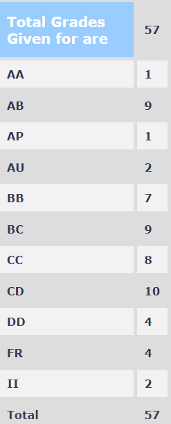

**PH403 – Quantum Mechanics**

**Session** 

Autumn 2018

**Instructor**

Sai Vinjanampathy

**Course Content**

The course started with the professor giving a brief overview of Quantum Mechanics. He expected that students have some prior experience in basic quantum mechanics although it was not a very hard prerequisite. He then taught the mathematics required to build the quantum mechanics formalism. He pressed on the importance of building the mathematical framework to understand quantum mechanics better. We then spent a few lectures on square wells, harmonic oscillator, 1D potentials, and scattering, tunneling, and transmission problems. We then covered some advanced topics like two-level systems, angular momentum, Laplace-Runge-Lenz vector, and addition of angular momentum. The prof also briefly touched some topics for heightening student’s curiosity. We ended with the addition of angular momentum, and QM2 was supposed to start from here.

**Prerequisite**

Basic knowledge from MA 106 and PH 107

**Feedback on the lectures**

We sat with first-year MSc students for this course. We had two 1.5 hours of lectures a week and an additional 1.5 hours tutorial on some weeks. The prof was very clear on his fundamentals. The lectures were slow in the beginning as the professor wanted everyone to be on the same page. The professor tried to keep the students involved and encouraged them to ask doubts. However, there were a few times when he couldn’t explain a topic well enough, but the professor made sure that he wouldn’t be testing the students on those topics.

**Feedback on Assignments/Tutorials/Exams**

We had around 5 classes of tutorials in which we discussed a few problems from the assignments given. The professor sometimes also used the tutorials to teach extra topics.

**Grading Statistics:** 

**Difficulty (on a scale of 1-5 with 5 being very tough)**

3

**Textbooks/References**

Standard QM textbooks can be used but none were followed in the course

**Softwares used**

None

**Comments**

Future extensions to this course is QM 2 and 3.

Reviewed by Adarsh Kumar