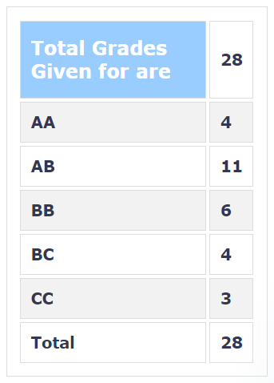

---

layout: page

title: Course Reviews

subtitle:

cover-img: assets/img/Cover_study.jpg

thumbnail-img: ""

share-img: ""

comments: true

tags: [Academic]

---

  
  

### CS 604 – Combinatorics

  
  

**Course offered in:**

  
  

Spring 2018

  
  

**Instructor:**

  
  

Sundar Vishwanathan

  
  

**Course Content:**

  
  

The course includes basic combinatorics and graph theory. Focus was on proving some theorems and statements based on given assumptions and statements using induction, basic probability theory and linear algebra.

  
  

**Prerequisites:**

  
  

No hard prerequisites but some courses in probability theory and linear algebra would help.

  
  

**Feedback on Lectures:**

  
  

The lectures were mostly problem solving and emphasis was on various methods to approach any problem. 5-6 problems were solved in each lecture which were already shared in previous classes and were to be tried before at home.

  
  

**Feedback on Tutorials, Assignments and Exams:**

  
  

No extra tutorials and assignments.  
3 Quizzes(Best 2 out of 3) – 50%  
Endsem – 50%  
All the exams were quite easy, had 3-5 questions and were totally based on what was taught in class. Every exam had a question which came directly from the sheets solved in class.

  
  

**Difficulty:**

  
  

3 (on a scale of 1-5, with 5 being very tough)

  
  

**Grading Statistics:**

  
  

  
  

**Study Material and References:**

  
  

None

  
  

Review by – Shrey Paharia
