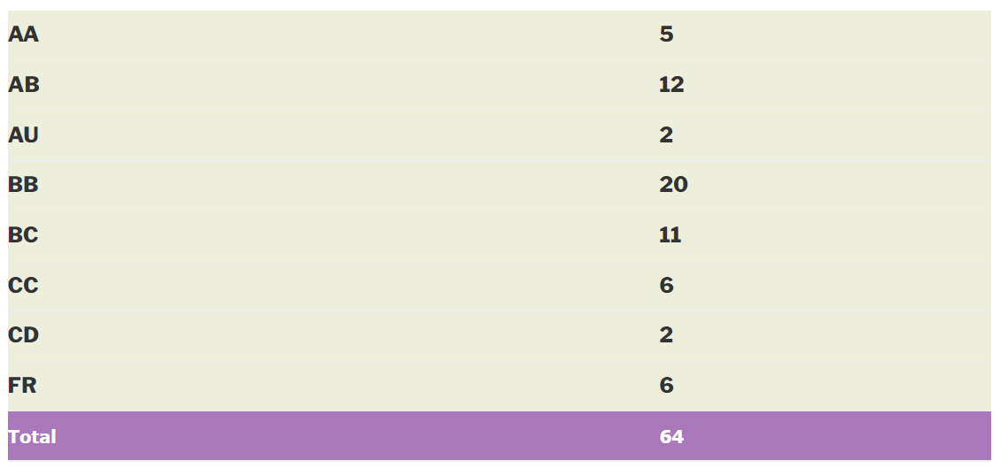

**

---

layout: page

title: Course Reviews

subtitle:

cover-img: assets/img/Cover_study.jpg

thumbnail-img: ""

share-img: ""

comments: true

tags: [Academic]

---

  
  

### CS 763 – COMPUTER VISION

  
  

**Course offered in:**

  
  

Spring 2014

  
  

**Instructor:**

  
  

Prof. Ajit Rajwade

**Motivation:** 

It’s usually a follow up course to Image Processing. So, most of the people come well acquainted. However, even those with no background in IP can do well in this course provided they are willing to do the labour. Computer vision has an immense scope of application across many fields. So even people from different departments can benefit from this course if they intend to use it in the field they pursue.
  

**Course Content:**

  
  
I am not listing out the contents in order. That can be found from _asc_ as well. The course gives an idea of how a vision system is implemented to start with ( Camera Calibration, Monocular/Stereo vision, Geometric Stereo) and then goes on to algorithms for image processing specific to each implementation. Photometry is also covered. De-noising algorithms, interpolation algorithms. A brief introduction to _Compressive Sensing_ with a follow-up assignment is also given towards the end of the course.

  
  

**Prerequisites:**

  
  

No hard and fast pre-requisite. However, having done/credited _Image Processing_ before does help.

  
  

**Feedback on Lectures:**

  
  

Fantastic. It’s all in Prof. Rajwade’s way of imparting instruction. Slides are meticulous and to the point.

  
  

**Feedback on Tutorials, Assignments and Exams:**

  
  

Exams are very standard. Questions test the thoroughness of one’s understanding of the concepts. There is(are) generally one(two) slightly tough question(s) apart from these. Assignments are the main instruments through which one actually learns CV. Very nicely framed, challenging and interesting, assignments plus the term project weigh almost half of the total evaluation.
  
  

**Difficulty:**

  
  

Moderately tough.

  
  

**Grading Statistics:**

  
  

  
  
**Attendance**

80% minimum or penalty as per the instructor’s discretion.

  
  

**Takeaways from the course:**

  
  
It opens up a world of directions to pursue higher studies/career in; Robotic navigation, bio-mimicry, neuromorphic vision, imaging and machine vision, to name a few. Has immense potential to shape/direct your BTP/DDP. Professor Rajwade is open to supervising students from other departments also, who’ve done outstanding in this course. He also plans to start an advanced course in _Compressive Sensing_ soon. Get to know about it from him.

  
  

Review by – **Anand Kalvit (anandiitb12@gmail.com)**

**