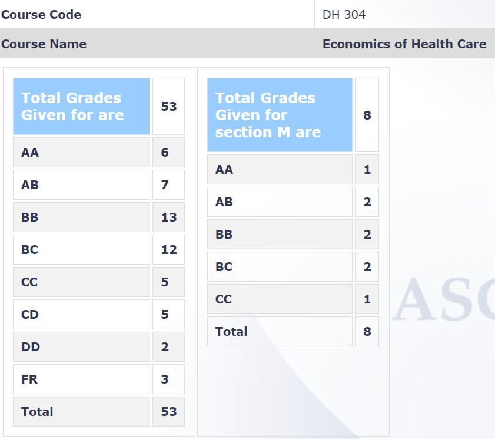

**Review by**

Nivedya S Nambiar, 2023(BTech.)

**Course Offered In**

Spring 2022

**Instructors**

Prof. Souvik Banerjee

**Prerequisites**

HS 101

**Difficulty**

2/5 Moderately easy course

**Course Content**

The course started off with an introduction to health economics and an overview of the Indian healthcare system. The demand and supply for healthcare in economic terms was then explained in great detail, including the concept of health insurance from an economic perspective, the disparities in healthcare and health behaviours like alcohol and drug abuse. Additionally, the economic impacts of mental illness and the economics of medicines was covered.
 
**Feedback on Lectures**

The lectures in the first half of the semester were online and the rest were offline. The attendance and class participation were noted and included in the evaluation. The lectures were easy to follow, and paced moderately fast. Actively participating in the class was a major factor in grasping concepts and it aids in getting a good grade. The instructor shared reference material before and after lectures which were relevant to the quiz and examinations.

**Feedback on Evaluations**

1. 5% Class participation (attendance and in-class questions)
2. 15% Quiz (1, pre-midsem)
3. 30% Mid-sem exam
4. 50% End-sem exam

All examinations were closed book. The lecture slides and the research papers shared prior to and after lectures were more or less sufficient to perform well in the examinations. Some topics required reading the reference books shared by the instructor.

**Study Material and References**

1. Folland, Goodman & Stano. The Economics of Health and Health Care, Fifth Edition, Prentice-Hall, 2007.
2. Bhattacharya, Hyde & Tu. Health Economics, First Edition, Palgrave Macmillan, 2014.
3. Glied, S & Smith, PC. The Oxford Handbook of Health Economics, Oxford University Press, 2011. 
4. Research articles for different topics were shared in class

**Final Takeaways**

The course covers the economic perspective of healthcare and builds on ideas from basic economics courses to present more advanced concepts in economics and their applications in the healthcare industry, which makes it a perfect segue into healthcare economics for students. The course was well-organised and the grading and evaluation scheme were moderately chill.

**Grading Statistics:**

