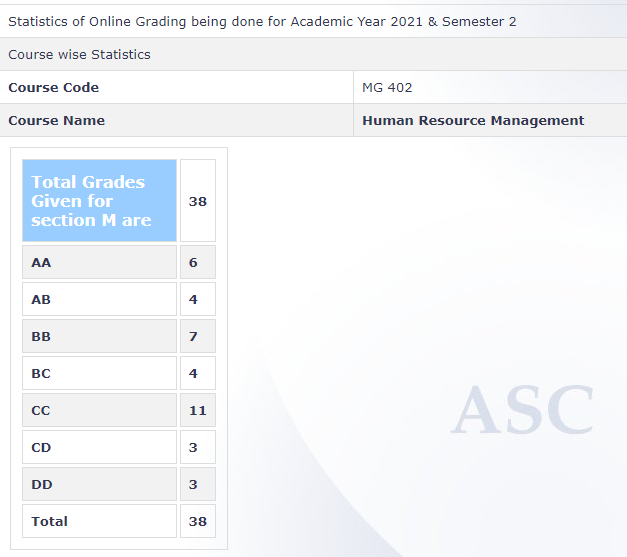

**Review by**

Krishna Soni (190070032)

**Course Offered In**

Spring 2021

**Instructors**

Prof. Shiv Ganesh Bhargava

**Course Content**

Human Resource Management. Principles of HRM. Who is a Manager and his responsibilities?
What is Human Resource Planning and Staffing? Recruitment & selection. Induction and
Orientation. Performance Appraisal & its various Methods. Strategic HR MG. Training. High
performing organisation. Green hrm.

 
**Feedback on Lectures**

This course is bit different from the rest of the courses. It involves no math and is very
theoretical subject but the prof is enthusiastic and explains concepts with various examples.
Although there are few case studies but they are representative of possible scenarios and
not actual real life cases unlike previous courses.

**Feedback on Evaluations**

The evaluation consisted of surprise
quizzes, midsem and endsem. In the surprise quizzes, the prof took a viva asking to explain
the concepts of previous few classes. The endsem and midsem comprised of q.s as asked in
surprise quizzes as well as suggesting solutions for some hypothetical scenarios.

**Final Takeaways**

I found this
course comparatively less interesting to other courses and more theoretical. But at the
same time, it requires the least effort (no efforts if you are attentive in class). Just attend
the 3 hrs of classes per week, take notes and study day before the endsem/midsem and
you needn’t do anything else. This is sufficient to even crack an AA

**Grading Statistics:**
