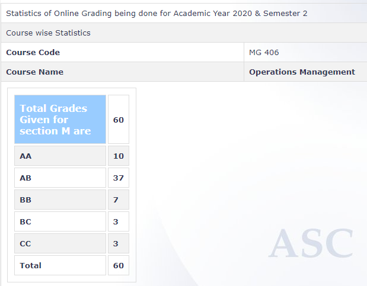

**Review by**

Krishna Soni (190070032)

**Course Offered In**

Spring 2020

**Instructors**

Prof. Rahul Patil

**Course Content**

Principles of Operations Management. Practices and Strategies in Operations Management.
Inventory Management. Supply Chain Design (Assembly Line). Planning and Controlling
Supply Chain. Scheduling. Continuous and Batch Processes. Quality Management
 
**Feedback on Lectures**

Prof. Patil has to be one of the most chill professors I ever had. The course will introduce
you to supply and production chains, assembly lines through sufficient hands on experience
on real life cases (some from Harvard Business School too).

**Feedback on Evaluations**

The course had 2 assignments,surprise quizzes (for which the prof. helped by providing hints and formulas on the slide), a midsem and endsem. The Exams were a mixture of numericals and theory, but were quite
easy if you had done the quizzes and assignments. The prof is great at teaching and quite
chill and even cancelled the proposed course project.  

**Final Takeaways**

This course is a bit mathematical
when compared to other courses as it involves supply chain management problems but the
formulas are provided, so you just need to know how to use them.

**Grading Statistics:**
